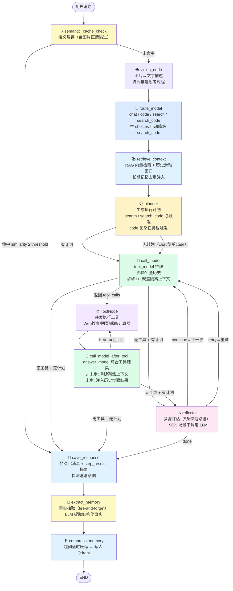
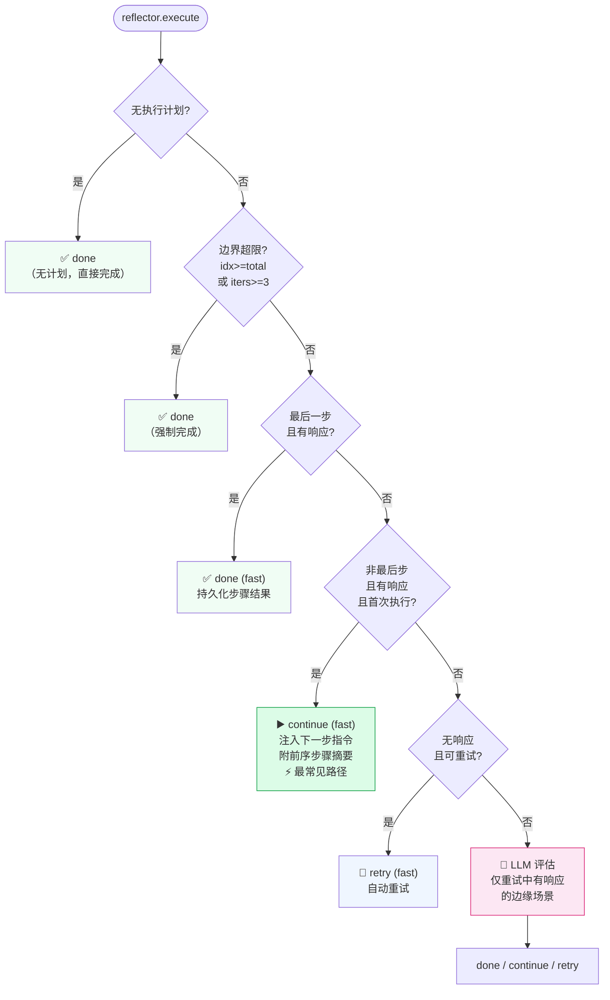
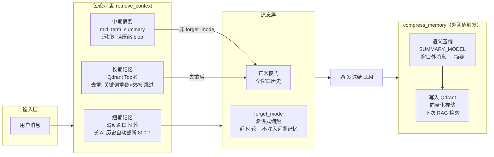
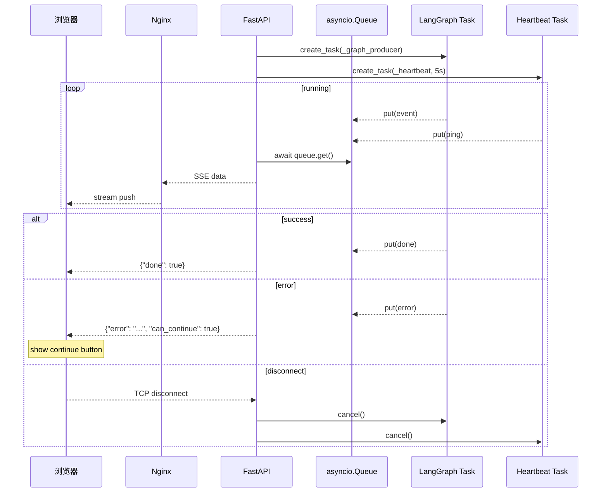
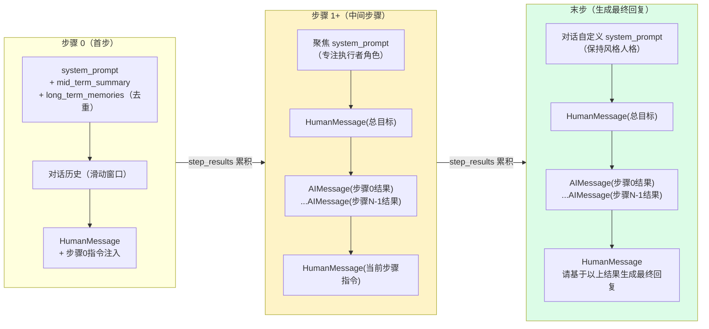
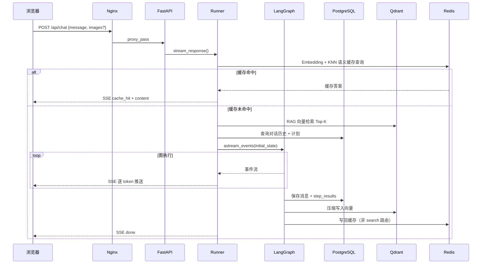

# ChatFlow — AI 智能对话平台

> 基于 LangChain + LangGraph 构建的新一代 AI 对话系统。
> **DB 驱动 + 状态机 + 模型无关 + 全链路流式** — 切换模型只改 `.env`，不改代码。

---

## 演示视频

[](https://www.bilibili.com/video/BV1bUSZBzEQ7?buvid=YF4C14F4733206BB412BBF37AAC4BDCE11FA&from_spmid=dt.dt.0.0&is_story_h5=false&mid=Qg%2Bfk0sn%2BD%2FajWCc6LzprA%3D%3D&plat_id=504&share_from=ugc&share_medium=iphone&share_plat=ios&share_session_id=1A9CFC59-BA95-421C-8BB2-E4D9C137A7A0&share_source=COPY&share_tag=s_i&spmid=dt.dt.0.0&timestamp=1775481987&unique_k=NdCRSTf&up_id=52293300&vd_source=b6eda8c8d8e6e7dcff168b4fddffd897)

---

## 核心特性

### 智能路由与认知规划
- **四层意图路由**：自动识别 `chat` / `code` / `search` / `search_code`，每类任务分配最优模型
- **路由解耦规划**：复杂 code 任务（长度 > 150 字或含"分析/重构/首先/分多步"等信号词）同样触发多步计划，不再局限于 search 路由
- **自动任务拆解**：复杂请求自动生成 1-10 步执行计划，可视化展示实时进度
- **可编辑工作流**：前端直接插入、删除、修改执行步骤后重新运行
- **高效步骤反思**：Reflector 节点内置 5 条快速路径，~90% 场景无需调用 LLM 即可决策

### 工具调用
- **内置工具**：Web 搜索（DuckDuckGo）、网页抓取、计算器、时间查询
- **MCP 协议扩展**：通过 `.env` 零代码接入任意 MCP 服务器（filesystem、github、fetch 等）
- **中间步骤工具调用**：code 路由多步执行时，中间步骤也可调用工具（如查 API 文档）

### 多模态理解
- **图片输入**：支持粘贴 / 拖拽 / 上传，客户端自动压缩（1280px / 82% 质量）
- **视觉解耦**：VisionNode 先将图片转为文字描述，主模型只处理文字——"分析归分析，推理归推理"
- **视觉流式推送**：分析过程逐 token 推送到思考折叠块中

### 三级记忆体系
| 层级 | 机制 | 特性 |
|------|------|------|
| **短期** | 滑动窗口（最近 N 轮） | 长 AI 历史回复自动截断至 800 字，防止 token 浪费 |
| **中期** | 达到阈值自动语义压缩 | 保留滑动窗口完整性，只压缩窗口外的远期消息 |
| **长期** | 压缩时写入 Qdrant，每轮 Top-K 检索 | 去重过滤：关键词重叠率 > 55% 的记忆不重复注入 |

**渐进式遗忘**：话题切换时不是二元切换，而是梯度缩短历史窗口，保留最近几轮基本连贯性

### 多步执行上下文隔离
- **步骤 1+** 完全不读 `state["messages"]` 积累历史，改用聚焦上下文：总目标 + 前序步骤结果摘要 + 当前步骤指令
- **中间步骤**：专注执行者系统提示，防止模型提前生成最终产品
- **末步**：恢复对话自定义 system prompt，确保最终回复风格符合用户期望
- **step_results 累积**：每步完成结果写入 `step_results[]`，最终一起持久化到 DB，下次对话可见完整执行过程

### 断点续传
- **错误恢复**：图执行中断（`GraphRecursionError` 等）时，已生成的部分响应自动保存到 DB
- **Continue 按钮**：前端检测到 `can_continue` 信号时展示"继续"按钮
- **计划持久化**：每次对话最新执行计划存入 DB，刷新页面后认知面板自动恢复

### 语义缓存
- **秒级响应**：相似问题命中 Redis KNN 缓存，跳过全部 LLM 推理链路
- **四种隔离模式**：`user` / `prompt` / `global` / `conv`
- **Write-through + TTL**：先写 DB 后写缓存，chat/code 24h TTL 兜底防缓存中毒

### DB-first 架构 + 状态机
- **DB 是唯一真相源**：所有状态（对话/消息/工具执行）由 DB 字段表达，不从文本推断
- **四层状态机**（`fsm/` 目录，基于 python-statemachine 框架）：
  - 对话：`ACTIVE → STREAMING → COMPLETED/ERROR`
  - 消息：`PRE_WRITE → STREAMING → FINALIZED/PARTIAL`
  - 工具执行：`RUNNING → DONE/ERROR/TIMEOUT`
  - SSE 事件：枚举注册表，按优先级匹配
- **Redis 跨 worker 共享**：停止信号（pub/sub）、活跃会话注册（TTL+心跳）、缓存失效通知
- **结构化字段分离**：`tool_summary`、`step_summary`、`clarification_data` 独立存储，不混入 `content`

### 模型无关
- **零代码切换**：改 `.env` 的 `LLM_BASE_URL` + `CHAT_MODEL` 即可换任意 OpenAI 兼容模型
- **桥接层**：`llm/client.py` 自动检测 `reasoning_content`（DeepSeek-R1/Claude Thinking）
- **COMPAT 兼容层**：模型特定行为（MiniMax 残留文本、`<think>` 标签）标记为 COMPAT，对其他模型空转无副作用

### 流式输出与实时反馈
- **全链路流式**：所有 LLM 调用（含工具绑定）都走 `stream=True`，禁用 `ainvoke`
- **工具参数实时可见**：`tool_call_args` 事件流式推送，前端终端实时显示代码生成过程
- **心跳保活**：每 3s 发 ping + Redis TTL 续期
- **优雅降级**：内容审核触发时自动降级响应，不中断 SSE 流

---

## 技术栈

| 层次 | 技术 |
|------|------|
| **后端框架** | Python 3.12 · FastAPI · asyncio |
| **AI 编排** | LangChain · LangGraph |
| **状态机** | python-statemachine（对话/工具/SSE 事件） |
| **前端框架** | Vue 3.5 · TypeScript 5.7 · Vite 6.2 |
| **UI 组件** | Element Plus 2.13 · @antv/x6 3.1 |
| **状态管理** | 自定义 Composable（按对话 ID 分离） |
| **API 通信** | fetch + SSE 流式（断点续传） |
| **关系数据库** | PostgreSQL 16（含 JSONB 原子更新） |
| **向量数据库** | Qdrant |
| **缓存/共享状态** | Redis Stack（语义缓存 KNN + 跨 worker 状态同步） |
| **部署** | Docker Compose · Nginx |

---

## 支持的模型

兼容任何 OpenAI 格式接口，可混合搭配：

| 提供商 | 典型模型 | 用途 |
|--------|---------|------|
| **Ollama（本地）** | qwen3、qwen2.5vl、bge-m3 | 全功能本地运行 |
| **OpenAI** | gpt-4o、text-embedding-3 | 高精度云端 |
| **智谱 GLM** | GLM-4、GLM-4.6V | 中文优化 + 视觉 |
| **MiniMax** | MiniMax-M2.7-highspeed | 长上下文 + 多模态 |
| **其他** | 任意 OpenAI 兼容接口 | 自由配置 |

---

## 快速开始

### Docker Compose（推荐）

```bash
git clone https://github.com/your-org/ChatFlow.git
cd ChatFlow/llm-chat

cp .env.example .env
# 编辑 .env，填写 API Key 和模型名称

docker compose up -d
docker compose logs -f backend
```

浏览器访问 **http://localhost**

```bash
docker compose down                  # 停止
docker compose up -d --build         # 代码更新后重新构建
```

### 本地开发

```bash
# 后端
cd llm-chat/backend
python -m venv venv && source venv/bin/activate   # Windows: venv\Scripts\activate
pip install -r requirements.txt
python main.py

# 前端（新终端）
cd llm-chat/frontend
npm install && npm run dev
```

后端：**http://localhost:8000** · 前端：**http://localhost:5173** · API 文档：**http://localhost:8000/docs**

---

## 配置说明

```bash
cp .env.example .env
```

### LLM 接口

```env
LLM_BASE_URL=https://api.openai.com/v1
API_KEY=sk-...
CHAT_MODEL=gpt-4o
SUMMARY_MODEL=gpt-4o-mini
EMBEDDING_MODEL=text-embedding-3-large
EMBEDDING_BASE_URL=                         # 留空复用 LLM_BASE_URL

VISION_MODEL=gpt-4o                         # 视觉模型（留空跳过图片分析）
VISION_BASE_URL=
VISION_API_KEY=
```

### 路由与模型映射

```env
ROUTER_ENABLED=true
ROUTER_MODEL=gpt-4o-mini
SEARCH_MODEL=gpt-4o
ROUTE_MODEL_MAP={"chat":"gpt-4o","code":"gpt-4o","search":"gpt-4o","search_code":"gpt-4o"}
```

### 记忆参数

```env
SHORT_TERM_MAX_TURNS=10
COMPRESS_TRIGGER=8
MAX_SUMMARY_LENGTH=500
LONGTERM_MEMORY_ENABLED=true
QDRANT_URL=http://qdrant:6333
EMBEDDING_DIM=3072
LONGTERM_TOP_K=3
LONGTERM_SCORE_THRESHOLD=0.5
```

### 语义缓存

```env
SEMANTIC_CACHE_ENABLED=true
REDIS_URL=redis://redis:6379
SEMANTIC_CACHE_THRESHOLD=0.88
SEMANTIC_CACHE_NAMESPACE_MODE=user       # user / prompt / global / conv
SEMANTIC_CACHE_SEARCH_TTL_HOURS=12
```

### MCP 工具扩展

```env
MCP_SERVERS={"filesystem":{"command":"npx","args":["-y","@modelcontextprotocol/server-filesystem","./data"],"transport":"stdio"}}
```

完整配置见 [`llm-chat/.env.example`](llm-chat/.env.example)

---

## 架构图

### LangGraph 完整执行流程



---

### Reflector 决策快速路径



---

### 三级记忆架构



---

### SSE 流式架构



---

### 多步执行上下文隔离



---

### 请求完整链路



---

## 项目结构

```
ChatFlow/
├── llm-chat/
│   ├── backend/
│   │   ├── main.py                         # FastAPI 入口 + API 路由
│   │   ├── config.py                       # 统一配置（pydantic-settings）
│   │   ├── graph/
│   │   │   ├── agent.py                    # LangGraph 图构建与编译
│   │   │   ├── state.py                    # GraphState（含 step_results 字段）
│   │   │   ├── edges.py                    # 条件路由逻辑
│   │   │   ├── event_types.py              # 节点输出类型定义
│   │   │   ├── nodes/
│   │   │   │   ├── base.py                 # BaseNode（_stream_tokens 等共享工具）
│   │   │   │   ├── vision_node.py          # 多模态图片理解（流式）
│   │   │   │   ├── route_node.py           # 意图路由（空 choices 防御）
│   │   │   │   ├── planner_node.py         # 认知规划（code 复杂任务也触发）
│   │   │   │   ├── retrieve_context_node.py # RAG + 历史组装
│   │   │   │   ├── call_model_node.py      # 主推理（步骤隔离上下文）
│   │   │   │   ├── call_model_after_tool_node.py # 工具后综合
│   │   │   │   ├── reflector_node.py       # 步骤评估（5条快速路径）
│   │   │   │   ├── save_response_node.py   # 持久化（step_results 摘要）
│   │   │   │   ├── extract_memory_node.py  # 事实抽取（fire-and-forget）
│   │   │   │   ├── compress_node.py        # 语义压缩节点
│   │   │   │   └── cache_node.py           # 语义缓存节点
│   │   │   └── runner/
│   │   │       ├── stream.py               # SSE 主驱动（队列+心跳+断点续传）
│   │   │       ├── context.py              # StreamContext
│   │   │       ├── dispatcher.py           # 事件分发（职责链）
│   │   │       └── handlers/               # 各类 SSE 事件处理器
│   │   ├── memory/
│   │   │   ├── store.py                    # 短期记忆 CRUD
│   │   │   ├── context_builder.py          # 消息组装（8层优先级+去重+渐进遗忘）
│   │   │   ├── compressor.py               # 语义压缩
│   │   │   ├── core_memory.py              # 核心常驻记忆
│   │   │   ├── tool_events.py              # 工具事件记录
│   │   │   └── schema.py                   # 数据模型
│   │   ├── rag/                            # 长期记忆（Qdrant）
│   │   │   ├── retriever.py                # 向量检索
│   │   │   ├── ingestor.py                 # 写入 Qdrant
│   │   │   └ fact_schema.py                # 事实结构定义
│   │   ├── cache/                          # 语义缓存（Redis KNN）
│   │   │   ├── base.py                     # 缓存基类
│   │   │   ├── redis_cache.py              # Redis 实现
│   │   │   └ factory.py                    # 缓存工厂
│   │   ├── fsm/                            # 状态机
│   │   │   ├── conversation.py             # 对话生命周期
│   │   │   ├── tool_execution.py           # 工具执行状态
│   │   │   ├── plan_step.py                # 计划步骤状态
│   │   │   └── sse_events.py               # SSE 事件类型注册表
│   │   ├── db/
│   │   │   ├── models.py                   # SQLAlchemy ORM
│   │   │   ├── database.py                 # 异步会话
│   │   │   ├── redis_state.py              # Redis 跨 worker 共享状态
│   │   │   ├── migrate.py                  # 幂等迁移
│   │   │   ├── plan_store.py               # 执行计划 CRUD
│   │   │   ├── artifact_store.py           # 文件产物存储
│   │   │   ├── tool_store.py               # 工具执行记录
│   │   │   ├── event_store.py              # SSE 事件日志
│   │   │   └ message_detail_store.py       # 消息详情
│   │   ├── llm/                            # LLM 工厂
│   │   │   ├── client.py                   # OpenAI 兼容客户端
│   │   │   ├── chat.py                     # Chat 模型封装
│   │   │   └ embeddings.py                 # Embedding 工厂
│   │   ├── tools/                          # 工具系统
│   │   │   ├── skill.py                    # Skill 框架（自动发现注册）
│   │   │   ├── builtin/                    # 内置工具
│   │   │   ├── sandboxed/                  # 沙箱工具
│   │   │   └ mcp/                          # MCP 协议扩展
│   │   ├── sandbox/                        # 代码沙箱执行
│   │   ├── ppt/                            # PPT 渲染
│   │   ├── routers/                        # API 路由模块
│   │   ├── services/                       # 服务层
│   │   ├── prompts/                        # 系统提示词目录
│   │   │   ├── system.md                   # 全局系统提示
│   │   │   └ nodes/                        # 节点专用提示词
│   │   ├── tests/                          # 测试代码
│   │   └── Dockerfile
│   ├── frontend/
│   │   ├── src/
│   │   │   ├── components/
│   │   │   │   ├── ChatView.vue            # 主对话界面 + Continue 按钮
│   │   │   │   ├── MessageItem.vue         # 消息渲染（Markdown + 沙盒预览）
│   │   │   │   ├── InputBox.vue            # 输入框 + 图片管理
│   │   │   │   ├── CognitivePanel.vue      # 右侧认知面板（计划刷新恢复）
│   │   │   │   ├── PlanFlowCanvas.vue      # 任务流程图（@antv/x6）
│   │   │   │   ├── ClarificationCard.vue   # 澄清交互卡片
│   │   │   │   └── AgentStatusBubble.vue   # 工具调用状态气泡
│   │   │   ├── composables/useChat.ts      # 核心状态管理（canContinue + continueLast）
│   │   │   ├── api/index.ts                # 后端 API 封装（onInterrupted 回调）
│   │   │   └── types/                      # TypeScript 类型
│   │   ├── nginx.conf
│   │   └── Dockerfile
│   ├── docker-compose.yml                  # 五容器编排
│   └── .env.example
├── docs/
│   ├── pain-points-analysis.md              # 痛点分析与升级路线图
│   └ ux-design.md                          # UX 设计分析
├── spec.md                                  # 开发规格（铁律+协议）
├── README.md                                # 本文档
├── start-mac.sh / start-prod.bat           # 启动脚本
├── stop-mac.sh / stop.bat                  # 停止脚本
```

---

## API 接口

后端启动后访问 **http://localhost:8000/docs** 查看完整文档。

| 方法 | 路径 | 说明 |
|------|------|------|
| `POST` | `/api/chat` | 流式对话（SSE），支持 `images` 字段 |
| `POST` | `/api/chat/{id}/stop` | 停止对话 |
| `GET` | `/api/conversations` | 对话列表 |
| `POST` | `/api/conversations` | 创建对话 |
| `GET` | `/api/conversations/{id}` | 对话详情 |
| `DELETE` | `/api/conversations/{id}` | 删除对话 |
| `GET` | `/api/conversations/{id}/full-state` | 完整状态恢复（消息+工具+计划+产物） |
| `GET` | `/api/conversations/{id}/resume` | SSE 断线重连（从 event_log 回放） |
| `GET` | `/api/conversations/{id}/streaming-status` | 流式状态检查 |
| `GET` | `/api/conversations/{id}/tools` | 工具调用历史 |
| `GET` | `/api/conversations/{id}/plan` | 最新执行计划 |
| `GET` | `/api/conversations/{id}/artifacts` | 文件产物列表 |
| `GET` | `/api/artifacts/{id}` | 产物完整内容（按需加载） |
| `GET` | `/api/conversations/{id}/memory` | 记忆状态调试 |
| `GET` | `/api/tools` | 可用工具列表 |

---

## SSE 事件参考

前端通过 EventSource 接收以下事件：

| 事件字段 | 说明 |
|---------|------|
| `{"content": "..."}` | LLM 输出 token（逐字流式） |
| `{"thinking": "..."}` | 推理模型 thinking 内容（折叠展示） |
| `{"tool_call_start": {"name": "..."}}` | 工具参数开始生成（前端立即显示终端 loading） |
| `{"tool_call_args": {"text": "..."}}` | 工具参数片段流式（终端实时显示代码生成） |
| `{"tool_call": {"name": "...", "input": {...}}}` | 工具参数生成完毕，开始执行 |
| `{"sandbox_output": {"stream": "stdout", "text": "..."}}` | 沙箱终端实时输出 |
| `{"tool_result": {"name": "...", "status": "done/error"}}` | 工具执行完成 |
| `{"search_item": {"url": "...", "title": "..."}}` | 搜索结果逐条推送 |
| `{"file_artifact": {"name": "...", "language": "..."}}` | 文件产物生成 |
| `{"status": "thinking/planning/routing"}` | 状态变更通知 |
| `{"route": {"model": "...", "intent": "..."}}` | 路由决策结果 |
| `{"plan_generated": {"steps": [...]}}` | 执行计划（含步骤标题和状态） |
| `{"reflection": {"content": "...", "decision": "..."}}` | 步骤评估结果 |
| `{"clarification": {"question": "...", "items": [...]}}` | 澄清问询卡片 |
| `{"done": true, "compressed": false}` | 流正常结束 |
| `{"error": "...", "can_continue": true}` | 执行出错，前端展示 Continue 按钮 |
| `{"ping": true}` | 心跳保活 |

---

## 相关文档

| 文档 | 说明 |
|------|------|
| [spec.md](spec.md) | 开发规格、铁律、协议、踩坑记录 |
| [docs/pain-points-analysis.md](docs/pain-points-analysis.md) | 痛点分析与 2.0 升级路线图 |
| [docs/ux-design.md](docs/ux-design.md) | UX 设计分析与改进建议 |
| [llm-chat/backend/README.md](llm-chat/backend/README.md) | 后端架构详解 |
| [llm-chat/frontend/README.md](llm-chat/frontend/README.md) | 前端架构详解 |

---

## 许可证

[MIT License](LICENSE)
