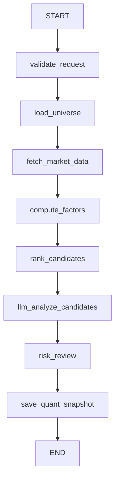

# ChatFlow 量化交易功能设计方案

_日期：2026-04-30_
_范围：`llm-chat/frontend/`、`llm-chat/backend/quant/`、`llm-chat/backend/graph/`_
_目标：新增一个面向 A 股选股分析的量化工作台，并能把分析结果接入现有对话继续深挖。_

---

## 0. TL;DR

第一阶段先做**选股分析**，不做自动实盘交易。

核心设计是：

1. 前端新增“量化”工作台，负责筛选条件、结果表、因子拆解、分析快照。
2. 后端新增 `quant/` 领域模块，抽象国内数据 API Provider，用 DI/Registry 支持多 SDK 接入和 fallback。
3. 新增独立的 `quant_agent` LangGraph，负责校验请求、拉取数据、计算因子、排序、LLM 分析、风险审查和保存快照。
4. 量化结果保存为 `quant_snapshots`，用户点击“接入对话继续分析”后，把快照作为结构化上下文注入现有聊天图。
5. 数值计算保持确定性，LLM 只做解释、归纳、风险提示和后续研究建议，避免让模型直接改排名。

---

## 1. 当前项目落点

| 层 | 现状 | 量化功能接入点 |
| --- | --- | --- |
| 前端入口 | `frontend/src/App.vue` 直接组织 `Sidebar / ChatView / CognitivePanel`，未接 `vue-router` | 第一版可在 `App.vue` 增加内部工作台切换：`chat / quant` |
| 前端 API | `frontend/src/api/index.ts` 统一封装 REST/SSE | 新增 `fetchQuantProviders`、`runQuantScreen`、`fetchQuantSnapshot` |
| 对话状态 | `frontend/src/composables/useChat.ts` 管理多会话和 SSE | 增加 `context_refs` 后可把量化快照带入对话 |
| 后端入口 | `backend/main.py` 初始化 DB、工具、LangGraph、路由 | 注册 `quant_router`，初始化量化 provider registry |
| LangGraph | `backend/graph/agent.py` 已有完整 Agent 图和 simple 图 | 新增并缓存 `quant` 图，不挤进通用聊天图 |
| 流式协议 | `backend/graph/runner/stream.py` DB-first SSE | 可复用 status / plan_generated / thinking / done 协议，必要时扩展 quant 事件 |
| 工具系统 | `backend/tools/skill.py` 自动发现工具 | 量化数据不建议先做成普通 LLM tool，应作为后端服务和专用图节点 |

---

## 2. 产品形态

### 2.1 页面定位

新增“量化”工作台，不做营销页，打开后直接进入可操作界面。

建议第一版页面结构：

```text
┌──────────────────────────────────────────────────────────────┐
│ 顶部：市场 / 股票池 / 日期 / Provider 状态 / 运行按钮          │
├─────────────────┬────────────────────────────────────────────┤
│ 筛选条件侧栏     │ 结果表：股票、综合分、因子分、风险标签        │
│ - 行业           │ - 技术面                                    │
│ - 市值/成交额    │ - 基本面                                    │
│ - PE/PB/ROE      │ - 流动性                                    │
│ - 动量/波动率    │ - 资金面                                    │
│ - 剔除 ST/停牌   │                                            │
├─────────────────┴────────────────────────────────────────────┤
│ 详情区：选中股票的因子拆解、行情摘要、LLM 分析、继续对话按钮     │
└──────────────────────────────────────────────────────────────┘
```

### 2.2 主要交互

1. 用户设置选股条件。
2. 前端请求 `/api/quant/screen`，后端返回任务流或一次性结果。
3. 结果表展示排名和因子分。
4. 用户点某只股票，详情区展示：
   - 最近行情摘要
   - 技术面因子
   - 基本面因子
   - 流动性/风险标签
   - 数据源和更新时间
   - LLM 解释
5. 用户点“接入对话继续分析”，系统创建/复用对话并携带 `quant_snapshot_id`。

---

## 3. 前端设计

### 3.1 目录建议

```text
frontend/src/
  components/
    QuantView.vue
    quant/
      QuantFilterPanel.vue
      QuantResultTable.vue
      QuantStockDrawer.vue
      QuantProviderStatus.vue
      QuantFactorBreakdown.vue
  composables/
    useQuant.ts
  api/
    index.ts
  types/
    index.ts
```

### 3.2 路由策略

当前项目没有 `vue-router`，且 `window.location.hash` 已用于恢复对话 ID。第一版建议先不要改全局路由：

```ts
type Workspace = 'chat' | 'quant'
const activeWorkspace = ref<Workspace>('chat')
```

在 `Sidebar.vue` 顶部增加“对话 / 量化”切换即可。后续如果页面继续增多，再引入 `vue-router`，并把会话恢复从 hash 改为 query 或 route param。

### 3.3 类型草案

```ts
export interface QuantProviderInfo {
  name: string
  enabled: boolean
  priority: number
  capabilities: string[]
  health: 'ok' | 'degraded' | 'down'
  message?: string
}

export interface QuantScreenCriteria {
  market: 'cn_a'
  universe: 'all' | 'hs300' | 'zz500' | 'custom'
  tradeDate: string
  industries?: string[]
  minMarketCap?: number
  minTurnover?: number
  peRange?: [number, number]
  pbRange?: [number, number]
  roeMin?: number
  momentumWindow?: number
  volatilityWindow?: number
  excludeST: boolean
  excludeSuspended: boolean
  excludeNewStocksDays?: number
}

export interface QuantScreenResult {
  snapshotId: string
  rows: QuantStockScore[]
  providerTrace: QuantProviderTrace[]
  generatedAt: number
}
```

### 3.4 API 草案

```ts
export async function fetchQuantProviders(): Promise<QuantProviderInfo[]>

export async function runQuantScreen(
  criteria: QuantScreenCriteria,
): Promise<QuantScreenResult>

export async function fetchQuantSnapshot(
  snapshotId: string,
): Promise<QuantScreenResult>

export async function continueQuantInChat(
  snapshotId: string,
  conversationId?: string,
): Promise<{ conversation_id: string }>
```

---

## 4. 后端领域设计

### 4.1 目录建议

```text
backend/quant/
  __init__.py
  domain.py
  config.py
  router.py
  service.py
  provider_registry.py
  providers/
    __init__.py
    base.py
    akshare_provider.py
    tushare_provider.py
    jqdata_provider.py
    rqdata_provider.py
  factors/
    __init__.py
    technical.py
    fundamental.py
    liquidity.py
    risk.py
  repositories/
    snapshot_store.py
```

### 4.2 领域模型

```python
class Stock(BaseModel):
    symbol: str          # 统一内部格式：000001.SZ / 600000.SH
    name: str
    market: str
    industry: str = ""
    list_date: str = ""


class ProviderCapability(str, Enum):
    STOCK_LIST = "stock_list"
    DAILY_BARS = "daily_bars"
    FUNDAMENTALS = "fundamentals"
    MONEY_FLOW = "money_flow"
    INDEX_WEIGHT = "index_weight"
    TRADING_CALENDAR = "trading_calendar"


class FactorScore(BaseModel):
    symbol: str
    technical: float
    fundamental: float
    liquidity: float
    risk: float
    total: float
    reasons: list[str]
    warnings: list[str]
```

### 4.3 Provider 抽象

```python
class MarketDataProvider(Protocol):
    name: str
    capabilities: set[ProviderCapability]

    async def health_check(self) -> ProviderHealth: ...
    async def list_stocks(self, market: str) -> list[Stock]: ...
    async def daily_bars(self, symbols: list[str], start: str, end: str) -> pd.DataFrame: ...
    async def fundamentals(self, symbols: list[str], date: str) -> pd.DataFrame: ...
    async def money_flow(self, symbols: list[str], date: str) -> pd.DataFrame: ...
    async def trading_calendar(self, start: str, end: str) -> list[str]: ...
```

接入原则：

- Provider 负责适配 SDK 和字段归一化。
- Service 只依赖 `MarketDataProvider` 协议，不直接 import `akshare/tushare/jqdatasdk/rqdatac`。
- 同步 SDK 统一用 `asyncio.to_thread()` 包装，避免阻塞 FastAPI event loop。
- Provider 返回的数据必须包含 `provider_name`、`as_of_date`、`fetched_at`，用于审计和解释。

### 4.4 DI / Registry

`ProviderRegistry` 负责按能力选择 provider：

```python
class ProviderRegistry:
    def register(self, provider: MarketDataProvider, priority: int) -> None: ...
    def get(self, capability: ProviderCapability) -> MarketDataProvider: ...
    async def get_with_fallback(self, capability: ProviderCapability) -> list[MarketDataProvider]: ...
```

选择规则：

1. capability 匹配。
2. env 配置启用。
3. health 不为 `down`。
4. priority 越小越优先。
5. 当前 provider 报错时自动 fallback，并记录 `provider_trace`。

配置示例：

```env
QUANT_ENABLED=true
QUANT_PROVIDER_ORDER=["tushare","akshare","jqdata","rqdata"]
TUSHARE_TOKEN="..."
JQDATA_USERNAME="..."
JQDATA_PASSWORD="..."
RQDATA_LICENSE_PATH="..."
```

---

## 5. 国内 API 接入建议

### 5.1 第一阶段推荐

| Provider | 定位 | 优点 | 注意事项 |
| --- | --- | --- | --- |
| AKShare | 免费/低门槛数据源 | 覆盖面广，安装简单，适合快速做原型 | 官方说明数据仅供研究参考，部分接口可能受数据源变化影响 |
| Tushare Pro | 结构化数据主力 | Python SDK + HTTP API，日线、财务、指数等接口清晰 | 需要 token，部分接口有积分/频次权限 |

### 5.2 第二阶段扩展

| Provider | 定位 | 适合场景 |
| --- | --- | --- |
| JoinQuant / JQData | 量化研究平台和本地数据 SDK | 因子、回测、A股/期货/基金等更完整研究 |
| Ricequant / RQData | 专业量化数据 API | 多资产数据、机构化研究、许可证环境 |
| 券商/交易柜台 API | 后续实盘交易 | 委托、成交、持仓、风控，不纳入第一阶段 |

参考链接：

- [AKShare 官方文档](https://akshare.akfamily.xyz/)
- [AKShare GitHub](https://github.com/akfamily/akshare)
- [Tushare 官方站](https://tushare.pro/)
- [Tushare HTTP API 文档](https://tushare.pro/document/2?doc_id=130)
- [JoinQuant API 指引](https://www.joinquant.com/help/api/guide)
- [RQData 文档](https://www.ricequant.com/doc/rqdata/python/manual.html)

---

## 6. 量化 LangGraph 设计

### 6.1 为什么新增独立图

不建议把量化逻辑塞进现有通用聊天图，原因：

- 通用图以用户自然语言为中心，量化图以结构化参数和确定性计算为中心。
- 选股分析需要固定流程、可复现分数、审计 provider trace。
- 后续会加回测、组合优化、风控，独立图更容易演化。

### 6.2 图结构



### 6.3 节点职责

| 节点 | 职责 | 是否调用 LLM |
| --- | --- | --- |
| `validate_request` | 校验日期、市场、股票池、筛选条件 | 否 |
| `load_universe` | 取股票池并剔除 ST、停牌、次新等 | 否 |
| `fetch_market_data` | 按 capability 从 provider 拉取行情/财务/资金数据 | 否 |
| `compute_factors` | 计算动量、波动率、估值、盈利、流动性等因子 | 否 |
| `rank_candidates` | 标准化因子、加权、排序、生成 warning | 否 |
| `llm_analyze_candidates` | 解释排名、总结候选股、提出后续研究问题 | 是 |
| `risk_review` | 生成风险提示、数据缺口、过拟合提醒 | 可选 |
| `save_quant_snapshot` | 保存快照和 provider trace | 否 |

### 6.4 状态草案

```python
class QuantGraphState(TypedDict):
    request_id: str
    client_id: str
    criteria: dict
    universe: list[dict]
    market_data: dict
    factor_rows: list[dict]
    ranked_rows: list[dict]
    provider_trace: list[dict]
    analysis: str
    risk_notes: list[str]
    snapshot_id: str
```

---

## 7. 因子与评分

第一版做“轻量多因子选股”，避免过度复杂。

### 7.1 因子集合

| 类别 | 因子 | 说明 |
| --- | --- | --- |
| 技术面 | 20/60 日动量 | 价格趋势 |
| 技术面 | 20 日波动率 | 风险控制，低波动更稳 |
| 技术面 | 均线偏离 | 避免极端追高 |
| 基本面 | PE/PB | 估值过滤 |
| 基本面 | ROE | 盈利质量 |
| 流动性 | 近 20 日平均成交额 | 避免无法交易 |
| 风险 | ST/停牌/次新/异常缺失 | 硬过滤或 warning |

### 7.2 评分原则

- 所有因子先 winsorize，再做 z-score 或 percentile rank。
- 缺失值不直接填 0，应记录缺失原因，并降低置信度。
- 综合分由配置权重计算，不由 LLM 决定。
- 结果必须带 `score_explain`，说明主要贡献因子。

示例权重：

```json
{
  "technical": 0.35,
  "fundamental": 0.35,
  "liquidity": 0.20,
  "risk": 0.10
}
```

---

## 8. 对话续接设计

### 8.1 快照表

新增 `quant_snapshots`：

| 字段 | 类型 | 说明 |
| --- | --- | --- |
| `id` | string | 快照 ID |
| `client_id` | string | 浏览器客户端 |
| `conversation_id` | string | 可为空，接入对话后回填 |
| `criteria` | JSONB | 用户筛选条件 |
| `rows` | JSONB | 排名结果 |
| `provider_trace` | JSONB | 数据源调用轨迹 |
| `analysis` | TEXT | LLM 分析摘要 |
| `risk_notes` | JSONB | 风险提示 |
| `created_at` | float | 创建时间 |

### 8.2 ChatRequest 扩展

```python
class ContextRef(BaseModel):
    type: str
    id: str


class ChatRequest(BaseModel):
    ...
    context_refs: list[ContextRef] = []
```

### 8.3 注入方式

`RetrieveContextNode` 或新的 context builder 扩展读取 `context_refs`：

```text
【量化选股快照】
快照 ID: qs_xxx
筛选日期: 2026-04-30
股票池: 沪深 A 股
前 10 名: ...
因子权重: ...
数据源: Tushare(daily/fundamental), AKShare(money_flow fallback)
风险提示: ...
```

原则：

- 不把完整 rows 全塞进 prompt，默认只注入 top N 和摘要。
- 用户明确要求“展开全部结果”时再分页或通过工具读取。
- 前端用户气泡显示自然语言，例如“继续分析这次选股结果”，不显示 JSON。

---

## 9. API 路由草案

```text
GET  /api/quant/providers
POST /api/quant/screen
GET  /api/quant/snapshots/{snapshot_id}
POST /api/quant/snapshots/{snapshot_id}/continue-chat
```

`POST /api/quant/screen` 第一版可先同步返回 JSON。若运行时间超过 3-5 秒，再改成 SSE：

```text
POST /api/quant/screen/stream
data: {"status":"loading_universe"}
data: {"status":"fetching_data","provider":"tushare"}
data: {"status":"computing_factors"}
data: {"status":"analyzing"}
data: {"quant_result": {...}}
data: {"done":true}
```

---

## 10. 安全与边界

必须在 UI 和模型提示中明确：

- 结果仅用于量化研究和辅助分析，不构成投资建议。
- 数据可能延迟、缺失或因 provider 权限不同而不完整。
- 第一阶段不支持实盘下单。
- 后续若接实盘，必须独立增加账户权限、交易风控、审计日志、人工确认和熔断机制。

工程边界：

- API token 只放后端 `.env`，不返回前端。
- provider_trace 可展示 provider 名称和时间，不展示密钥、账号和原始错误堆栈。
- 所有外部 SDK 调用设置 timeout 和限流。
- 快照结果要记录数据日期，避免用户把历史筛选误读为实时信号。

---

## 11. 实施里程碑

### M1：后端基础能力

- 新增 `backend/quant/` 模块。
- 实现 `MarketDataProvider` 协议和 `ProviderRegistry`。
- 接入 AKShare、Tushare 两个 provider。
- 新增 `/api/quant/providers` 和 `/api/quant/screen`。
- 加单元测试覆盖 provider fallback、字段归一化、因子计算。

### M2：前端量化工作台

- 新增 `QuantView.vue` 和 `useQuant.ts`。
- 在 `App.vue` 增加 `chat / quant` 工作台切换。
- 实现筛选表单、结果表、详情区、provider 状态。
- 支持保存最近一次筛选条件到 localStorage。

### M3：量化 LangGraph

- 新增 `backend/graph/quant_agent.py`。
- 增加 `QuantGraphState` 和节点实现。
- 在 `main.py` 启动时初始化 quant 图。
- 支持 SSE 进度和 `quant_snapshots` 保存。

### M4：对话续接

- DB 新增 `quant_snapshots`。
- `ChatRequest` 增加 `context_refs`。
- 对话上下文构建支持读取量化快照摘要。
- 前端“接入对话继续分析”打通到现有 `useChat.send()`。

### M5：质量和可观测性

- provider health check。
- provider 调用耗时、失败率、fallback 次数日志。
- 快照可复现测试：固定输入生成稳定排名。
- 增加免责声明和数据新鲜度标识。

---

## 12. 测试建议

| 类型 | 覆盖点 |
| --- | --- |
| 单元测试 | 代码格式转换、因子计算、缺失值处理、权重合成 |
| 集成测试 | AKShare/Tushare provider 在 token 缺失和失败时 fallback |
| API 测试 | `/api/quant/screen` 参数校验、返回结构、错误信息 |
| 图测试 | quant graph 节点顺序、快照保存、LLM 分析不改排名 |
| 前端测试 | 筛选条件、结果表排序、详情切换、继续对话 |

---

## 13. 后续演进

1. 加回测：`quant_backtest_agent`，支持收益、回撤、换手、胜率、基准对比。
2. 加组合优化：行业约束、单票上限、风险预算。
3. 加自定义因子：用户上传 Python 因子或用表达式 DSL。
4. 加定时任务：每日收盘后自动刷新股票池和快照。
5. 加研究报告产物：把一次筛选分析导出为 Markdown / PDF / PPT。
6. 加模拟盘/实盘：必须单独设计交易权限、风控和人工确认。
