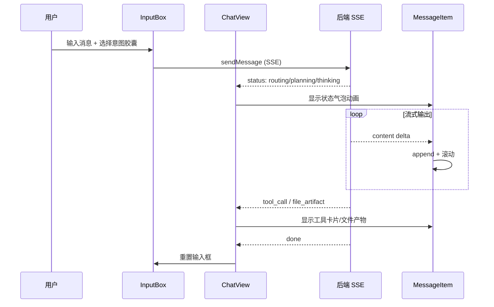

# ChatFlow UX 设计分析

_日期：2026-04-25_
_分析范围：llm-chat/frontend/src 的用户界面和交互设计_

---

## 1. 设计风格

### Bilibili 风格设计系统

采用 CSS Variables 设计系统，以 Bilibili 平台为灵感：

| 变量 | 色值 | 用途 |
|------|------|------|
| `--cf-bg` | #f4f5f7 | 背景色 |
| `--cf-bili-blue` | #00a1d6 | 主色调（品牌色） |
| `--cf-bili-pink` | #fb7299 | 强调色（操作按钮） |
| `--cf-bili-orange` | #ff9a2e | 次强调色（警告/进度） |

支持**亮色/暗色模式切换**，通过 `body.dark` 类控制。

---

## 2. 界面布局

### 三栏布局结构

```
┌─────────────┬──────────────────────┬─────────────────┐
│   Sidebar   │      ChatView        │ CognitivePanel  │
│  (240px)    │      (主区域)         │   (可折叠)      │
│             │                      │                 │
│  对话列表    │   消息流 + 输入框     │  计划 + 工具日志 │
│  搜索/新建   │   状态标签/进度条     │  文件产物预览   │
└─────────────┴──────────────────────┴─────────────────┘
```

### 响应式设计

- **桌面优先**：设计以桌面端为主
- **侧边栏折叠**：小屏幕可折叠 Sidebar
- **认知面板可拖拽**：用户可调整宽度
- **建议**：增加移动端适配（当前较弱）

---

## 3. 核心交互流程

### 聊天交互流程



### Agent 模式增强

Agent 模式下额外展示：

- **执行计划**：CognitivePanel 显示步骤列表
- **工具调用日志**：实时显示工具名称、参数、结果
- **思考过程**：折叠块显示 LLM reasoning_content
- **文件产物**：卡片展示生成的文件

---

## 4. 特色 UI 组件

### 意图胶囊

| 模式 | 图标 | 功能 |
|------|------|------|
| **PPT** | 📊 | 主题画廊（预设模板） + 档位选配（页数/风格） |
| **研究** | 🔍 | 档位网格（快速/标准/深度） |
| **代码** | 💻 | 技术栈偏好 |
| **创作** | ✏️ | 内容类型选择 |

### 状态标签

| 状态 | 标签样式 |
|------|---------|
| `routing` | 蓝色胶囊 "正在分析意图" |
| `planning` | 黄色胶囊 "正在规划步骤" |
| `thinking` | 紫色胶囊 "正在思考" |
| `tool` | 粉色胶囊 + 工具名称 |
| `reflecting` | 橙色胶囊 "正在评估进度" |
| `done` | 绿色胶囊 "完成" |

### 进度条

- 顶部固定渐变进度条
- 蓝粉双色渐变动画
- 完成时平滑消失

---

## 5. 流式渲染与智能滚动

### 流式渲染策略

| 内容类型 | 渲染方式 |
|----------|---------|
| 普通文本 | 逐 token append |
| Markdown | marked 实时解析 |
| 代码块 | highlight.js 高亮 |
| LaTeX | KaTeX 渲染 |
| 思考过程 | 折叠块 + 段式追加 |

### 滚动策略

- **智能滚动**：用户在底部时自动跟随，用户向上滚动时停止跟随
- **新消息提示**：停止跟随时显示"新消息"按钮
- **历史加载**：滚动到顶部时加载更多历史

---

## 6. 用户控制权

### 停止机制

- **停止按钮**：InputBox 显示红色停止按钮（Agent 模式）
- **停止握手**：stop_token → SSE 确认 → UI 重置
- **部分保存**：停止后已生成内容保留

### 断线重连

- **网络中断**：自动尝试 resume（after_event_id）
- **刷新恢复**：full-state API 从 DB 恢复完整状态
- **防抖策略**：2 秒内不重复请求 full-state

---

## 7. 动画与过渡效果

| 场景 | 动画 |
|------|------|
| 新消息进入 | fade-in + slide-up |
| 状态切换 | 胶囊颜色渐变 |
| 工具调用 | loading 旋转 + 卡片展开 |
| 面板折叠 | smooth resize |
| 按钮交互 | hover scale |

---

## 8. 可访问性评估

### 已有支持

| 方面 | 实现 |
|------|------|
| 键盘导航 | Tab 切换、Enter 发送 |
| 高对比度 | 暗色模式 |
| 屏幕阅读器 | 语义化 HTML |

### 待改进项

| 方面 | 建议 |
|------|------|
| ARIA 标签 | 添加 aria-label 到交互组件 |
| 焦点管理 | 工具调用完成后焦点回归输入框 |
| 颜色对比度 | 部分浅色文字对比度不足 |

---

## 9. 改进建议

### 高优先级

| 问题 | 建议 |
|------|------|
| 移动端适配弱 | 响应式断点优化、触摸交互改进 |
| 认知面板宽度固定 | 改为可拖拽 + 保存用户偏好 |
| 长消息性能 | 虚拟滚动优化 |

### 中优先级

| 问题 | 建议 |
|------|------|
| 工具日志过多 | 分页或折叠旧日志 |
| 暗色模式不完整 | 补充所有组件的暗色样式 |
| 文件预览加载慢 | 添加 loading 状态 |

### 低优先级

| 问题 | 建议 |
|------|------|
| 快捷键缺失 | 添加 Ctrl+Enter 发送、Esc 停止等 |
| 消息搜索 | 添加对话内搜索功能 |

---

## 10. UX 亮点总结

| 亮点 | 说明 |
|------|------|
| **流式实时感** | 全链路 SSE，用户感知 AI "正在工作" |
| **状态透明** | routing/planning/thinking/tool 全程可见 |
| **意图预配置** | 意图胶囊减少澄清轮次 |
| **产物可视化** | 文件产物卡片 + 8 种预览 |
| **认知面板** | Agent 模式下的计划可视化增强信任 |
| **断点恢复** | 刷新/断网后无缝恢复 |

---

## 参考

- Element Plus 设计系统
- Bilibili 视觉风格
- ChatGPT 流式交互模式
- Claude Artifacts UI