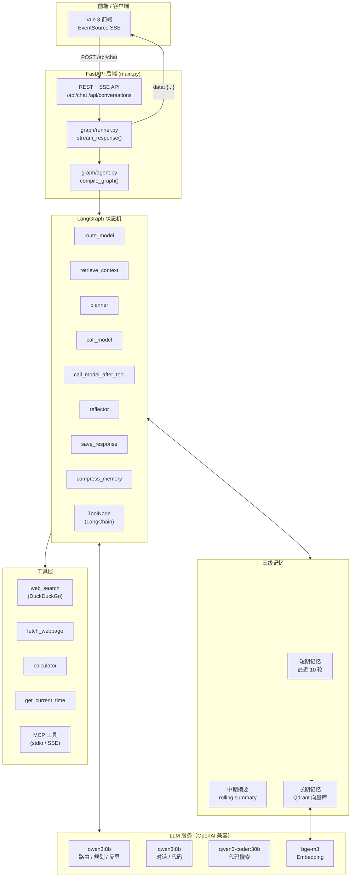
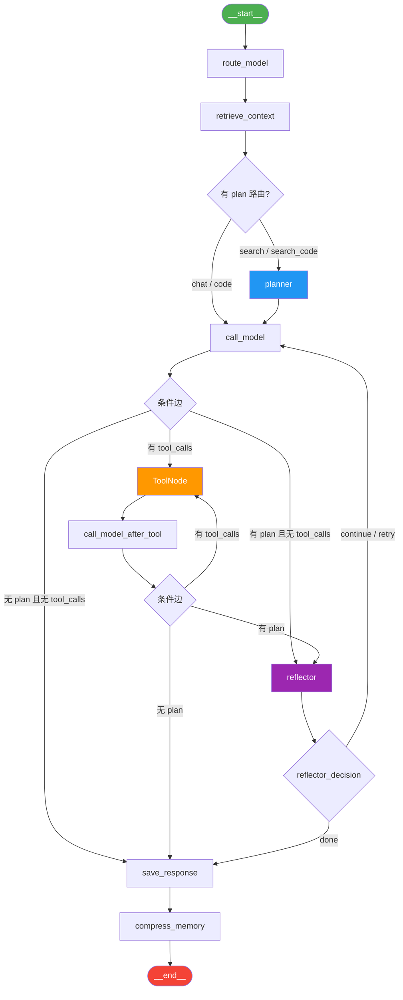
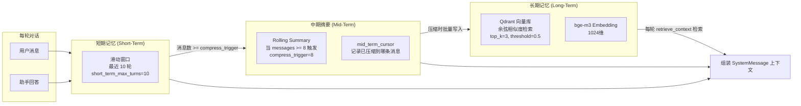
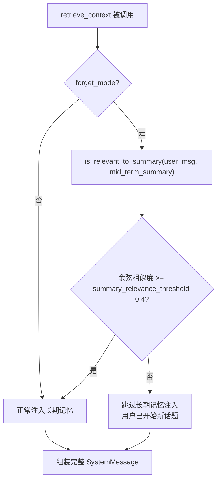
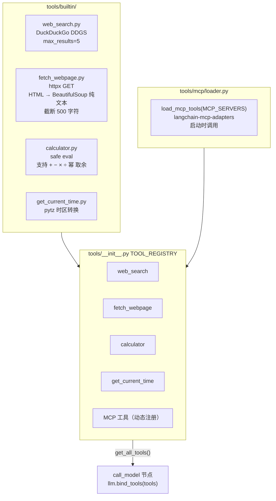

# ChatFlow Backend — LangChain + LangGraph AI 对话系统

> 基于 LangGraph 构建的多阶段、流式 AI 对话后端，支持意图路由、多步规划、工具调用、三级记忆和 MCP 扩展。

---

## 目录

1. [全局架构](#全局架构)
2. [LangGraph 图结构](#langgraph-图结构)
3. [完整示例：简单问题](#完整示例简单问题--今天几点了)
4. [完整示例：复杂问题](#完整示例复杂问题--帮我分析最近三个月-ai-发展趋势)
5. [GraphState 快照对比](#graphstate-快照对比)
6. [SSE 事件完整时序](#sse-事件完整时序)
7. [三级记忆系统](#三级记忆系统)
8. [选择性遗忘机制](#选择性遗忘机制)
9. [工具系统](#工具系统)
10. [MCP 接入](#mcp-接入)
11. [API 接口表](#api-接口表)
12. [配置说明](#配置说明env)
13. [常见问题](#常见问题)

---

## 全局架构



### 模块职责速览

| 文件 | 职责 |
|------|------|
| `main.py` | FastAPI 应用入口，lifespan 初始化，所有 HTTP 路由 |
| `config.py` | pydantic-settings 配置，支持 `.env` 覆盖 |
| `models.py` | Pydantic 请求/响应模型 |
| `graph/agent.py` | 编译并缓存 LangGraph 图（按 model 键缓存） |
| `graph/nodes.py` | 所有节点函数（工厂模式依赖注入） |
| `graph/edges.py` | 条件边：`should_continue()` / `reflector_routing()` |
| `graph/runner.py` | `stream_response()` + `EventDispatcher` SSE 事件发射 |
| `graph/state.py` | `GraphState` / `PlanStep` TypedDict |
| `llm/chat.py` | `get_chat_llm()` / `get_summary_llm()` LRU 缓存 |
| `llm/embeddings.py` | `get_embeddings()` OllamaEmbeddings 单例 |
| `memory/store.py` | `ConversationStore` 内存字典 + 磁盘 JSON |
| `memory/context_builder.py` | `build_messages()` → `list[BaseMessage]` |
| `memory/compressor.py` | `maybe_compress()` 触发中期摘要 + Qdrant 写入 |
| `rag/retriever.py` | `search_memories()` Qdrant 向量检索 |
| `rag/ingestor.py` | `store_pair()` 批量写入 Qdrant |
| `tools/__init__.py` | `get_all_tools()` / `register_tool()` / `TOOL_REGISTRY` |
| `tools/mcp/loader.py` | `load_mcp_tools()` langchain-mcp-adapters |

---

## LangGraph 图结构



### 节点详解

#### `route_model`
使用廉价模型 `qwen3:8b` 对用户意图进行分类，输出路由决策：

```python
# 输出写入 GraphState
{
  "route": "search",           # chat | code | search | search_code
  "tool_model": "qwen3:8b",    # SEARCH_MODEL，用于工具调用阶段
  "answer_model": "qwen3:8b",  # ROUTE_MODEL_MAP[route]，用于最终回答
}
```

路由模型映射（可通过配置覆盖）：

| route | answer_model |
|-------|-------------|
| `chat` | `qwen3:8b` |
| `code` | `qwen3-coder:30b` |
| `search` | `qwen3:8b` |
| `search_code` | `qwen3-coder:30b` |

#### `retrieve_context`
- 从 Qdrant 检索相关长期记忆（`search_memories()`）
- 遗忘模式下检查话题相关性（`is_relevant_to_summary()`）
- 调用 `context_builder.build_messages()` 组装完整消息列表
- 将当前用户消息追加到 `messages`

#### `planner`
仅对 `search` / `search_code` 路由触发。LLM 生成一个包含 2-5 步的 JSON 执行计划：

```python
{
  "plan": [PlanStep, ...],
  "current_step_index": 0,
  "step_iterations": 0
}
```

#### `call_model`
- 仅对 search 路由绑定工具（`llm.bind_tools(tools)`）
- 从当前步骤（`plan[current_step_index]`）读取 `description` 作为任务指令
- 使用 `tool_model`（搜索阶段）调用 LLM

#### `call_model_after_tool`
- 工具执行完毕后调用
- 使用 `answer_model`（非工具调用模型）生成回答
- 与 `call_model` 共享相同的条件边逻辑

#### `reflector`
评估当前步骤完成情况，输出三种决策之一：

| 决策 | 含义 | 下一节点 |
|------|------|---------|
| `done` | 全部步骤完成 | `save_response` |
| `continue` | 当前步骤完成，推进到下一步 | `call_model` |
| `retry` | 当前步骤未完成，重试（最多 2 次） | `call_model` |

#### `save_response`
- 将用户消息和助手回答持久化到磁盘 JSON
- 如有工具调用，追加 `【工具调用记录】` 摘要到 `full_response`

#### `compress_memory`
- 调用 `maybe_compress()`
- 当消息数量 `>= COMPRESS_TRIGGER`（默认 8）时触发
- 生成中期摘要（rolling summary）并将对话对写入 Qdrant

---

## 完整示例：简单问题 — "今天几点了"

### 请求

```http
POST /api/chat
Content-Type: application/json
X-Client-ID: user_abc

{
  "conversation_id": "conv_001",
  "message": "今天几点了",
  "model": "qwen3:8b",
  "temperature": 0.7
}
```

### 执行流程

**步骤 1：`route_model`**

`qwen3:8b` 分析用户意图：

```
用户说："今天几点了"
→ 需要实时时间信息 → route: "search"
```

GraphState 变化：
```python
state["route"] = "search"
state["tool_model"] = "qwen3:8b"
state["answer_model"] = "qwen3:8b"
```

SSE 事件：
```
data: {"status": "routing"}
data: {"route": {"model": "qwen3:8b", "intent": "search"}}
```

**步骤 2：`retrieve_context`**

- 查询 Qdrant：无相关长期记忆（新对话）
- `build_messages()` 组装：

```python
[
  SystemMessage("你是一个准确诚实的AI助手...\n你拥有以下工具：web_search, fetch_webpage, calculator, get_current_time..."),
  HumanMessage("今天几点了"),  # 当前消息追加
]
```

GraphState 变化：
```python
state["long_term_memories"] = []
state["messages"] = [SystemMessage(...), HumanMessage("今天几点了")]
```

**步骤 3：`planner`**

因为是 search 路由，触发规划节点。问题非常简单，LLM 生成最小计划：

```python
state["plan"] = [
  {
    "id": "1",
    "title": "查询时间",
    "description": "使用 get_current_time 工具查询当前北京时间",
    "status": "running",
    "result": ""
  }
]
state["current_step_index"] = 0
state["step_iterations"] = 0
```

SSE 事件：
```
data: {"status": "planning"}
data: {"plan_generated": {"steps": [{"id":"1","title":"查询时间","description":"使用 get_current_time 工具查询当前北京时间","status":"running","result":""}]}}
```

**步骤 4：`call_model`**

`qwen3:8b` 读取步骤描述，决定调用工具：

```python
# LLM 输出 tool_call
AIMessage(
  content="",
  tool_calls=[{"name": "get_current_time", "args": {"timezone": "Asia/Shanghai"}, "id": "tc_001"}]
)
```

SSE 事件：
```
data: {"status": "thinking", "model": "qwen3:8b"}
data: {"tool_call": {"name": "get_current_time", "input": {"timezone": "Asia/Shanghai"}}}
```

条件边检查：`has tool_calls` → 路由到 `tools`

**步骤 5：`ToolNode` 执行**

```python
# 工具返回结果
ToolMessage(
  content="2026-03-29 14:35:22 CST (UTC+8)",
  tool_call_id="tc_001"
)
```

SSE 事件：
```
data: {"tool_result": {"name": "get_current_time"}}
```

**步骤 6：`call_model_after_tool`**

使用 `answer_model` (`qwen3:8b`) 生成最终回答，流式输出 token：

```
data: {"content": "现"}
data: {"content": "在"}
data: {"content": "北"}
data: {"content": "京"}
data: {"content": "时"}
data: {"content": "间"}
data: {"content": "是"}
data: {"content": " "}
data: {"content": "2026"}
data: {"content": "年"}
data: {"content": "3月29日"}
data: {"content": " 14:35"}
data: {"content": "，"}
data: {"content": "是下午两点半左右。"}
```

条件边检查：`has plan` 且步骤只有1步 → 路由到 `reflector`

**步骤 7：`reflector`**

评估步骤1是否完成：

```python
# reflector 输出
state["reflector_decision"] = "done"
state["reflection"] = "步骤1已完成，时间查询成功获得准确结果，无需继续。"
state["plan"] = [
  {"id": "1", "title": "查询时间", "status": "done", "result": "2026-03-29 14:35:22 CST"}
]
```

因为 `decision = "done"` → 路由到 `save_response`

**步骤 8：`save_response`**

写入磁盘：

```json
{
  "id": "conv_001",
  "title": "今天几点了",
  "messages": [
    {"role": "user", "content": "今天几点了", "timestamp": 1743228900.0},
    {
      "role": "assistant",
      "content": "现在北京时间是 2026年3月29日 14:35，是下午两点半左右。\n\n【工具调用记录】\n- 调用工具: get_current_time({\"timezone\": \"Asia/Shanghai\"})",
      "timestamp": 1743228905.0
    }
  ],
  "updated_at": 1743228905.0
}
```

**步骤 9：`compress_memory`**

消息数 = 2，未达到阈值 8，跳过压缩。

SSE 完成事件：
```
data: {"done": true, "compressed": false}
```

---

## 完整示例：复杂问题 — "帮我分析最近三个月 AI 发展趋势"

### 执行流程

**步骤 1：`route_model`** — 路由为 `search`

```
data: {"status": "routing"}
data: {"route": {"model": "qwen3:8b", "intent": "search"}}
```

**步骤 2：`retrieve_context`** — 假设有相关长期记忆

```python
state["long_term_memories"] = [
  "3个月前：用户曾询问过 GPT-4o 发布情况",
  "上周：用户关注过 DeepSeek-R2 的相关消息",
]
```

组装的 SystemMessage 包含：
```
你是一个准确诚实的AI助手...

【长期记忆】
3个月前：用户曾询问过 GPT-4o 发布情况
上周：用户关注过 DeepSeek-R2 的相关消息
```

**步骤 3：`planner`** — 生成多步计划

LLM 输出（已解析到 GraphState）：

```python
state["plan"] = [
  {
    "id": "1",
    "title": "搜索近期趋势",
    "description": "使用 web_search 搜索 '2025-2026年 AI 发展趋势最新新闻'，关注大模型发布、技术突破",
    "status": "running",
    "result": ""
  },
  {
    "id": "2",
    "title": "搜索重要事件",
    "description": "搜索 '2026年Q1 AI 领域重要产品发布和商业进展'",
    "status": "pending",
    "result": ""
  },
  {
    "id": "3",
    "title": "搜索监管动态",
    "description": "搜索 'AI 监管政策 2025-2026 欧盟 中国 美国'",
    "status": "pending",
    "result": ""
  },
  {
    "id": "4",
    "title": "综合分析",
    "description": "基于以上搜索结果，从技术突破、商业应用、监管政策三个维度综合分析趋势",
    "status": "pending",
    "result": ""
  }
]
state["current_step_index"] = 0
state["step_iterations"] = 0
```

SSE 事件：
```
data: {"status": "planning"}
data: {"plan_generated": {"steps": [
  {"id":"1","title":"搜索近期趋势","description":"使用 web_search 搜索...","status":"running","result":""},
  {"id":"2","title":"搜索重要事件","description":"搜索 '2026年Q1...'","status":"pending","result":""},
  {"id":"3","title":"搜索监管动态","description":"搜索 'AI 监管政策...'","status":"pending","result":""},
  {"id":"4","title":"综合分析","description":"基于以上搜索结果...","status":"pending","result":""}
]}}
```

**步骤 4：`call_model`（步骤 1）**

```
data: {"status": "thinking", "model": "qwen3:8b"}
data: {"tool_call": {"name": "web_search", "input": {"query": "2025-2026年 AI 发展趋势最新新闻", "max_results": 5}}}
```

工具绑定的 LLM 生成 tool_call，路由到 `ToolNode`。

**`ToolNode` 执行 `web_search`**

```
data: {"search_item": {"url": "https://techcrunch.com/2026/03/ai-trends", "title": "The Biggest AI Developments of Early 2026", "status": "done"}}
data: {"search_item": {"url": "https://www.nature.com/articles/ai-progress-2026", "title": "AI Research Progress: Q1 2026 Review", "status": "done"}}
data: {"search_item": {"url": "https://mp.weixin.qq.com/s/ai-2026-china", "title": "2026年一季度中国AI大模型进展回顾", "status": "done"}}
data: {"tool_result": {"name": "web_search"}}
```

**步骤 5：`call_model_after_tool`（步骤 1 总结）**

LLM 内部处理搜索结果，生成步骤 1 的结论（不对外流式输出，仅写入步骤 result）。条件边：`has plan` → `reflector`

**步骤 6：`reflector`（步骤 1 评估）**

```python
# reflector 输出
state["reflector_decision"] = "continue"
state["reflection"] = "步骤1搜索完成，获得5条有效新闻，信息覆盖技术和商业面，继续执行步骤2"
state["plan"] = [
  {"id":"1","title":"搜索近期趋势","status":"done",
   "result":"获取到5条关于2025-2026年AI趋势的新闻，包括GPT-5发布、Gemini 2.0更新、国内大模型竞争加剧等信息"},
  {"id":"2","title":"搜索重要事件","status":"running","result":""},
  {"id":"3","title":"搜索监管动态","status":"pending","result":""},
  {"id":"4","title":"综合分析","status":"pending","result":""}
]
state["current_step_index"] = 1
state["step_iterations"] = 0
# reflector 还向 messages 追加一条 HumanMessage 作为步骤推进指令：
# HumanMessage("步骤1已完成。\n\n**[执行步骤 2/4]: 搜索重要事件**\n具体任务：搜索 '2026年Q1 AI 领域重要产品发布和商业进展'")
```

SSE 事件（步骤状态更新）：
```
data: {"reflection": {"content": "步骤1搜索完成，获得5条有效新闻...", "decision": "continue"}}
data: {"plan_generated": {"steps": [
  {"id":"1","title":"搜索近期趋势","status":"done","result":"获取到5条..."},
  {"id":"2","title":"搜索重要事件","status":"running","result":""},
  {"id":"3","title":"搜索监管动态","status":"pending","result":""},
  {"id":"4","title":"综合分析","status":"pending","result":""}
]}}
```

`decision = "continue"` → 路由回 `call_model`

**步骤 7-10：步骤 2、3 循环执行**

与步骤 1 相同模式，每次循环：
1. `call_model` → 调用 web_search
2. `ToolNode` → 返回搜索结果（search_item 事件）
3. `call_model_after_tool` → LLM 处理结果
4. `reflector` → 评估完成情况，推进到下一步

**步骤 11：步骤 4 — 综合分析（无工具调用）**

LLM 读取步骤 4 的描述和前三步的 result，直接生成综合分析文本，流式输出：

```
data: {"status": "thinking", "model": "qwen3:8b"}
data: {"content": "## 最近三个月 AI 发展趋势分析\n\n"}
data: {"content": "### 一、技术突破\n\n"}
data: {"content": "**大模型能力持续跃升**：..."}
data: {"content": "### 三、监管政策\n\n"}
data: {"content": "欧盟 AI Act 进入执行阶段..."}
```

`call_model` 没有 tool_calls，有 plan → 路由到 `reflector`

**步骤 12：`reflector`（步骤 4 完成）**

```python
state["reflector_decision"] = "done"
state["reflection"] = "所有步骤已完成，综合分析已基于三次搜索结果生成，质量达标。"
state["plan"][3]["status"] = "done"
```

SSE 事件：
```
data: {"reflection": {"content": "所有步骤已完成...", "decision": "done"}}
data: {"plan_generated": {"steps": [全部 status: "done"]}}
```

`decision = "done"` → 路由到 `save_response`

**步骤 13：`save_response` + `compress_memory`**

```
data: {"done": true, "compressed": false}
```

---

## GraphState 快照对比

下表展示每个节点执行后 GraphState 的关键字段变化（以"帮我分析 AI 趋势"为例）：

| 节点 | `route` | `plan` 长度 | `current_step_index` | `reflector_decision` | `messages` 条数 |
|------|---------|------------|---------------------|---------------------|----------------|
| 初始 | `""` | 0 | 0 | `""` | 0 |
| `route_model` 后 | `"search"` | 0 | 0 | `""` | 0 |
| `retrieve_context` 后 | `"search"` | 0 | 0 | `""` | 2（sys+user） |
| `planner` 后 | `"search"` | 4 | 0 | `""` | 2 |
| `call_model` 后（步骤1） | `"search"` | 4 | 0 | `""` | 3（+AI tool_call） |
| `ToolNode` 后 | `"search"` | 4 | 0 | `""` | 4（+ToolMessage） |
| `call_model_after_tool` 后 | `"search"` | 4 | 0 | `""` | 5（+AI answer） |
| `reflector` 后（步骤1→2） | `"search"` | 4 | **1** | `"continue"` | 6（+HumanMessage 步骤指令） |
| `reflector` 后（步骤4完成） | `"search"` | 4 | **3** | **`"done"`** | 14 |
| `save_response` 后 | `"search"` | 4 | 3 | `"done"` | 14（磁盘已写） |

### GraphState 完整结构

```python
class GraphState(TypedDict):
    # 基础会话信息
    conv_id: str                # 对话 ID，如 "conv_001"
    user_message: str           # 当前用户消息原文
    model: str                  # 前端请求的基础模型
    temperature: float          # 生成温度

    # 消息序列（LangGraph Annotated，自动 add_messages）
    messages: Annotated[Sequence[BaseMessage], add_messages]

    # 记忆
    long_term_memories: list[str]   # Qdrant 检索结果
    forget_mode: bool               # 是否启用选择性遗忘

    # 输出
    full_response: str          # 最终完整回答文本
    compressed: bool            # 本轮是否触发了压缩

    # 路由与模型
    tool_model: str             # 工具调用阶段的模型（SEARCH_MODEL）
    answer_model: str           # 最终回答阶段的模型（ROUTE_MODEL_MAP[route]）
    route: str                  # 'chat' | 'code' | 'search' | 'search_code'

    # 规划与反思
    plan: list[PlanStep]        # 执行计划
    current_step_index: int     # 当前执行步骤索引
    reflection: str             # 最新反思内容
    reflector_decision: str     # 'continue' | 'done' | 'retry'
    step_iterations: int        # 当前步骤重试次数（上限 2）
```

### PlanStep 完整结构

```python
class PlanStep(TypedDict):
    id: str          # 步骤序号，如 "1"、"2"
    title: str       # 简短标签，最多 10 字符，如 "搜索近期趋势"
    description: str # 详细任务说明，供 LLM 理解执行目标
    status: str      # 'pending' | 'running' | 'done' | 'failed'
    result: str      # 步骤执行结果摘要（由 reflector 填写）
```

---

## SSE 事件完整时序

所有事件格式为：`data: {JSON}\n\n`

### 事件类型参考表

| 事件字段 | 触发节点 | 含义 |
|---------|---------|------|
| `{"status": "routing"}` | `route_model` 开始前 | 正在进行意图路由 |
| `{"route": {"model": "...", "intent": "..."}}` | `route_model` 完成后 | 路由结果 |
| `{"status": "planning"}` | `planner` 开始前 | 正在生成执行计划 |
| `{"plan_generated": {"steps": [...]}}` | `planner` 完成后 / `reflector` 后 | 完整计划（含最新状态） |
| `{"status": "thinking", "model": "..."}` | `call_model` 开始前 | LLM 开始思考 |
| `{"tool_call": {"name": "...", "input": {...}}}` | `call_model` 输出 tool_call | 工具即将被调用 |
| `{"search_item": {"url": "...", "title": "...", "status": "done"}}` | `ToolNode` 执行中 | 单条搜索结果实时追加 |
| `{"tool_result": {"name": "..."}}` | `ToolNode` 完成后 | 工具执行完毕 |
| `{"reflection": {"content": "...", "decision": "..."}}` | `reflector` 完成后 | 反思结果 |
| `{"content": "..."}` | `call_model` / `call_model_after_tool` 流式 | 增量 token |
| `{"done": true, "compressed": bool}` | `compress_memory` 完成后 | 整轮对话结束 |
| `{"stopped": true}` | 用户主动停止 | 客户端断开或调用 stop 接口 |
| `{"error": "..."}` | 任意节点异常 | 错误信息 |

### 简单问题完整 SSE 序列

```
data: {"status": "routing"}

data: {"route": {"model": "qwen3:8b", "intent": "search"}}

data: {"status": "planning"}

data: {"plan_generated": {"steps": [{"id":"1","title":"查询时间","description":"使用 get_current_time 工具查询当前北京时间","status":"running","result":""}]}}

data: {"status": "thinking", "model": "qwen3:8b"}

data: {"tool_call": {"name": "get_current_time", "input": {"timezone": "Asia/Shanghai"}}}

data: {"tool_result": {"name": "get_current_time"}}

data: {"content": "现"}
data: {"content": "在"}
data: {"content": "北京时间是 "}
data: {"content": "2026"}
data: {"content": "年3月29日 14:35，"}
data: {"content": "是下午两点半左右。"}

data: {"reflection": {"content": "步骤1完成，时间查询成功。", "decision": "done"}}

data: {"plan_generated": {"steps": [{"id":"1","title":"查询时间","status":"done","result":"2026-03-29 14:35:22 CST"}]}}

data: {"done": true, "compressed": false}
```

### 复杂多步问题完整 SSE 序列（4步计划）

```
data: {"status": "routing"}
data: {"route": {"model": "qwen3:8b", "intent": "search"}}

data: {"status": "planning"}
data: {"plan_generated": {"steps": [
  {"id":"1","title":"搜索近期趋势","status":"running","result":""},
  {"id":"2","title":"搜索重要事件","status":"pending","result":""},
  {"id":"3","title":"搜索监管动态","status":"pending","result":""},
  {"id":"4","title":"综合分析","status":"pending","result":""}
]}}

# ── 步骤 1 ──
data: {"status": "thinking", "model": "qwen3:8b"}
data: {"tool_call": {"name": "web_search", "input": {"query": "2025-2026年 AI 发展趋势", "max_results": 5}}}
data: {"search_item": {"url": "https://techcrunch.com/2026/03/ai-trends", "title": "The Biggest AI Developments of Early 2026", "status": "done"}}
data: {"search_item": {"url": "https://www.nature.com/articles/ai-progress", "title": "AI Research Progress: Q1 2026 Review", "status": "done"}}
data: {"search_item": {"url": "https://mp.weixin.qq.com/s/ai-2026-china", "title": "2026年Q1中国AI大模型进展回顾", "status": "done"}}
data: {"tool_result": {"name": "web_search"}}
data: {"reflection": {"content": "步骤1搜索完成，获得5条有效信息，继续步骤2", "decision": "continue"}}
data: {"plan_generated": {"steps": [
  {"id":"1","title":"搜索近期趋势","status":"done","result":"获取到5条AI趋势新闻，覆盖技术和商业面"},
  {"id":"2","title":"搜索重要事件","status":"running","result":""},
  {"id":"3","title":"搜索监管动态","status":"pending","result":""},
  {"id":"4","title":"综合分析","status":"pending","result":""}
]}}

# ── 步骤 2 ──
data: {"status": "thinking", "model": "qwen3:8b"}
data: {"tool_call": {"name": "web_search", "input": {"query": "2026年Q1 AI 重要产品发布 商业进展", "max_results": 5}}}
data: {"search_item": {"url": "https://openai.com/blog/gpt5", "title": "Introducing GPT-5", "status": "done"}}
data: {"search_item": {"url": "https://deepmind.google/gemini-2", "title": "Gemini 2.0 Ultra Release", "status": "done"}}
data: {"tool_result": {"name": "web_search"}}
data: {"reflection": {"content": "步骤2完成，获取到重要产品发布信息，继续步骤3", "decision": "continue"}}
data: {"plan_generated": {"steps": [
  {"id":"1","title":"搜索近期趋势","status":"done","result":"..."},
  {"id":"2","title":"搜索重要事件","status":"done","result":"获取GPT-5、Gemini 2.0等重大发布信息"},
  {"id":"3","title":"搜索监管动态","status":"running","result":""},
  {"id":"4","title":"综合分析","status":"pending","result":""}
]}}

# ── 步骤 3 ──
data: {"status": "thinking", "model": "qwen3:8b"}
data: {"tool_call": {"name": "web_search", "input": {"query": "AI 监管政策 2025-2026 欧盟 中国 美国", "max_results": 5}}}
data: {"search_item": {"url": "https://ec.europa.eu/ai-act-2026", "title": "EU AI Act Enforcement Begins", "status": "done"}}
data: {"tool_result": {"name": "web_search"}}
data: {"reflection": {"content": "步骤3完成，监管动态已收集，继续步骤4综合分析", "decision": "continue"}}
data: {"plan_generated": {"steps": [
  {"id":"1","title":"搜索近期趋势","status":"done","result":"..."},
  {"id":"2","title":"搜索重要事件","status":"done","result":"..."},
  {"id":"3","title":"搜索监管动态","status":"done","result":"欧盟AI法案执行、中国AI管理办法更新"},
  {"id":"4","title":"综合分析","status":"running","result":""}
]}}

# ── 步骤 4：最终综合分析，流式 token ──
data: {"status": "thinking", "model": "qwen3:8b"}
data: {"content": "## 最近三个月 AI 发展趋势分析\n\n"}
data: {"content": "### 一、技术突破\n\n"}
data: {"content": "**大模型能力持续跃升**：GPT-5 于2026年2月正式发布..."}
data: {"content": "\n\n### 三、监管政策\n\n"}
data: {"content": "欧盟 AI Act 于2026年一季度进入执行阶段..."}

data: {"reflection": {"content": "步骤4综合分析完成，覆盖技术、商业、监管三维度，质量达标。", "decision": "done"}}
data: {"plan_generated": {"steps": [
  {"id":"1","title":"搜索近期趋势","status":"done","result":"..."},
  {"id":"2","title":"搜索重要事件","status":"done","result":"..."},
  {"id":"3","title":"搜索监管动态","status":"done","result":"..."},
  {"id":"4","title":"综合分析","status":"done","result":"已生成三维度综合分析"}
]}}

data: {"done": true, "compressed": false}
```

---

## 三级记忆系统



### 短期记忆

- 存储最近 `SHORT_TERM_MAX_TURNS`（默认 10）轮对话
- 以 `HumanMessage` + `AIMessage` 交替形式保存在 `messages`
- `context_builder.py` 从 `conv.messages[mid_term_cursor:]` 取窗口内消息

### 中期摘要（Rolling Summary）

当 `len(conv.messages) - mid_term_cursor >= COMPRESS_TRIGGER` 时触发：

1. 取窗口内旧消息（不含最近 2 轮）
2. 调用 `summary_model`（qwen3:8b）生成摘要
3. 将摘要拼接到 `conv.mid_term_summary`
4. 更新 `mid_term_cursor`

摘要注入到 SystemMessage：
```
【对话背景摘要】
用户之前讨论了 iPhone 16 的价格，助手通过网络搜索发现当前价格约为 5999 元起，
并对比了 Plus 和 Pro 版本的差异。用户对 Pro 版本的钛金属边框比较感兴趣。
```

### 长期记忆（Qdrant）

- 在 `compress_memory` 时，将对话对 batch 写入 Qdrant
- 每轮对话在 `retrieve_context` 中执行向量检索
- 检索时使用用户消息作为 query，cosine 相似度阈值 0.5
- 最多返回 top 3 条历史记忆

注入到 SystemMessage：
```
【长期记忆】
3个月前：用户曾询问过 GPT-4o 发布情况
上周：用户关注过 DeepSeek-R2 的相关消息
```

### 完整 SystemMessage 组装结构

```python
# context_builder.build_messages() 最终输出
[
  SystemMessage("""你是一个准确、诚实的AI助手，用中文回答用户问题。

你拥有可以调用的工具。遇到以下情况时，必须主动调用工具获取信息...

【对话背景摘要】
用户之前询问了 iPhone 16 价格（5999元起），对 Pro 版本感兴趣。

【长期记忆】
3个月前：用户曾询问过 GPT-4o 发布情况
上周：用户关注过 DeepSeek-R2 的相关消息
"""),
  HumanMessage("上次那个问题"),          # 历史窗口（最近 10 轮）
  AIMessage("回答..."),
  HumanMessage("现在帮我查..."),         # 当前用户消息（在 retrieve_context 中追加）
]
```

### 磁盘存储格式

```json
{
  "id": "conv_001",
  "title": "AI 发展趋势分析",
  "system_prompt": "",
  "messages": [
    {
      "role": "user",
      "content": "帮我分析最近三个月 AI 发展趋势",
      "timestamp": 1743228900.0
    },
    {
      "role": "assistant",
      "content": "## 最近三个月 AI 发展趋势分析\n\n...\n\n【工具调用记录】\n- 调用工具: web_search({\"query\": \"2025-2026年 AI 发展趋势\"})\n- 调用工具: web_search({\"query\": \"2026年Q1 AI 重要产品发布\"})\n- 调用工具: web_search({\"query\": \"AI 监管政策 2025-2026\"})",
      "timestamp": 1743229050.0
    }
  ],
  "mid_term_summary": "",
  "mid_term_cursor": 0,
  "client_id": "user_abc",
  "updated_at": 1743229050.0
}
```

---

## 选择性遗忘机制

当 `forget_mode = True` 时，`retrieve_context` 会检测当前问题是否与历史摘要相关。



### 工作原理

- `is_relevant_to_summary()` 使用 bge-m3 对用户消息和中期摘要分别做 embedding
- 计算余弦相似度，低于 `SUMMARY_RELEVANCE_THRESHOLD`（默认 0.4）时认为是新话题
- 新话题不注入旧记忆，避免"拖尾效应"
- `SHORT_TERM_FORGET_TURNS`（默认 2）：连续 N 轮无关问答后，旧摘要被认为无关

### 示例场景

```
轮次 1-3: 用户讨论 iPhone 16 价格（mid_term_summary 记录了这些内容）
轮次 4: 用户突然问"写一首关于春天的诗"
  → is_relevant_to_summary("写一首关于春天的诗", "iPhone 16 价格...") → 相似度 0.05
  → 低于阈值 0.4 → 跳过旧记忆注入
  → LLM 直接回答诗歌，不受 iPhone 话题干扰
```

---

## 工具系统



### 内置工具详情

#### `web_search(query, max_results=5)`
- 使用 DuckDuckGo DDGS 异步搜索
- 返回格式：`[{"title": "...", "url": "...", "body": "..."}]`
- 每条结果触发一个 `search_item` SSE 事件（实时推送到前端）

#### `fetch_webpage(url)`
- 使用 `httpx` 发起 GET 请求
- 使用 BeautifulSoup 解析 HTML，提取纯文本
- 按 `FETCH_WEBPAGE_MAX_DISPLAY`（默认 500 字）截断
- 常与 `web_search` 配合使用，先搜索后精读页面详情

#### `calculator(expression)`
- 安全 eval，禁止 `__import__`、`exec` 等危险操作
- 支持：`2**10`, `sqrt(16)`, `(3+4)*5`, `100 % 7`
- 返回：`"expression = result"`，如 `"2**10 = 1024"`

#### `get_current_time(timezone="Asia/Shanghai")`
- 使用 pytz 获取指定时区当前时间
- 返回：`"2026-03-29 14:35:22 CST (UTC+8)"`

### 工具注册机制

```python
# tools/__init__.py
TOOL_REGISTRY: dict[str, BaseTool] = {}

def register_tool(tool: BaseTool):
    TOOL_REGISTRY[tool.name] = tool

def get_all_tools() -> list[BaseTool]:
    return list(TOOL_REGISTRY.values())

def get_tool_names() -> list[str]:
    return list(TOOL_REGISTRY.keys())
```

内置工具在模块导入时自动注册，MCP 工具在 `load_mcp_tools()` 加载完成后调用 `register_tool()` 动态写入。

---

## MCP 接入

ChatFlow 通过 `langchain-mcp-adapters` 支持标准 MCP（Model Context Protocol）工具服务器。

### 配置方式

在 `.env` 或环境变量中设置 `MCP_SERVERS`（JSON 字符串）：

#### stdio 传输（本地进程）

```env
MCP_SERVERS={"filesystem": {"command": "npx", "args": ["-y", "@modelcontextprotocol/server-filesystem", "/tmp"], "transport": "stdio"}}
```

#### SSE 传输（远程服务）

```env
MCP_SERVERS={"my_server": {"url": "http://my-mcp-server:8080/sse", "transport": "sse"}}
```

#### 多服务器配置

```env
MCP_SERVERS={"filesystem": {"command": "npx", "args": ["-y", "@modelcontextprotocol/server-filesystem", "/home/user"], "transport": "stdio"}, "brave_search": {"command": "npx", "args": ["-y", "@modelcontextprotocol/server-brave-search"], "env": {"BRAVE_API_KEY": "sk-..."}, "transport": "stdio"}}
```

### 加载流程

```
lifespan 启动
  └─ load_mcp_tools(MCP_SERVERS)
       ├─ 遍历每个 server_name / server_config
       ├─ 根据 transport 类型（stdio/sse）初始化 MCP 客户端
       ├─ 调用 langchain-mcp-adapters 获取工具列表
       └─ 对每个工具调用 register_tool() 写入 TOOL_REGISTRY
```

### 验证 MCP 工具已加载

```http
GET /api/tools

{
  "tools": [
    {"name": "web_search", "description": "..."},
    {"name": "fetch_webpage", "description": "..."},
    {"name": "calculator", "description": "..."},
    {"name": "get_current_time", "description": "..."},
    {"name": "filesystem__read_file", "description": "..."},
    {"name": "filesystem__write_file", "description": "..."}
  ]
}
```

---

## API 接口表

### 对话管理

| 方法 | 路径 | 描述 | 请求体 / 参数 | 响应 |
|------|------|------|--------------|------|
| `GET` | `/api/conversations` | 获取当前客户端的所有对话 | Header: `X-Client-ID` | `{"conversations": [...]}` |
| `POST` | `/api/conversations` | 创建新对话 | `{"title": "...", "system_prompt": "..."}` | `{"id": "...", "title": "..."}` |
| `GET` | `/api/conversations/{id}` | 获取对话详情 + 消息历史 | — | 完整对话对象 |
| `PATCH` | `/api/conversations/{id}` | 更新对话标题或系统提示词 | `{"title": "...", "system_prompt": "..."}` | `{"ok": true}` |
| `DELETE` | `/api/conversations/{id}` | 删除对话（含 Qdrant 向量） | — | `{"ok": true}` |

### 聊天

| 方法 | 路径 | 描述 | 请求体 | 响应 |
|------|------|------|--------|------|
| `POST` | `/api/chat` | 流式对话（SSE） | `ChatRequest` | `text/event-stream` |
| `POST` | `/api/chat/{id}/stop` | 停止当前流式输出 | — | `{"ok": true}` |

#### `ChatRequest` 结构

```json
{
  "conversation_id": "conv_001",
  "message": "帮我查一下 iPhone 16 价格",
  "model": "qwen3:8b",
  "temperature": 0.7
}
```

### 工具与调试

| 方法 | 路径 | 描述 | 响应 |
|------|------|------|------|
| `GET` | `/api/tools` | 当前所有可用工具列表 | `{"tools": [...]}` |
| `GET` | `/api/models` | Ollama 已下载模型列表 | `{"models": [...]}` |
| `GET` | `/api/conversations/{id}/memory` | 记忆状态调试信息 | 见下方示例 |
| `POST` | `/api/embedding` | 测试 embedding 接口 | `{"dimensions": 1024, "vector_preview": [...]}` |

#### 记忆调试响应示例

```json
{
  "total_messages": 16,
  "summarised_count": 8,
  "window_count": 8,
  "mid_term_summary": "用户询问了 iPhone 16 价格（5999元起）、AI 发展趋势、以及 Python 异步编程相关问题。",
  "long_term_stored_pairs": 4,
  "active_tools": ["web_search", "fetch_webpage", "calculator", "get_current_time"]
}
```

---

## 配置说明（.env）

配置文件位于项目根目录 `llm-chat/.env`，所有字段均可通过同名环境变量覆盖（环境变量优先级更高）。

### 完整 .env 示例

```env
# ── LLM 服务地址（OpenAI 兼容接口）──────────────────────────────────────────
# Ollama 本地:
LLM_BASE_URL=http://localhost:11434/v1
API_KEY=ollama

# vLLM 示例:
# LLM_BASE_URL=http://localhost:8000/v1
# API_KEY=token-abc123

# OpenAI 官方:
# LLM_BASE_URL=https://api.openai.com/v1
# API_KEY=sk-...

# Docker 容器内连接宿主机 Ollama:
# LLM_BASE_URL=http://host.docker.internal:11434/v1

# ── Embedding 服务（Ollama 原生 API）──────────────────────────────────────────
OLLAMA_BASE_URL=http://localhost:11434

# ── 模型配置 ──────────────────────────────────────────────────────────────────
CHAT_MODEL=qwen3:8b
SUMMARY_MODEL=qwen3:8b
EMBEDDING_MODEL=bge-m3

# ── 路由配置 ──────────────────────────────────────────────────────────────────
ROUTER_ENABLED=true
ROUTER_MODEL=qwen3:8b
SEARCH_MODEL=qwen3:8b

# 路由模型映射（JSON 字符串）
ROUTE_MODEL_MAP={"code":"qwen3-coder:30b","search":"qwen3:8b","chat":"qwen3:8b","search_code":"qwen3-coder:30b"}

# ── 上下文窗口 ────────────────────────────────────────────────────────────────
CHAT_NUM_CTX=4096
SUMMARY_NUM_CTX=2048
FETCH_WEBPAGE_MAX_DISPLAY=500

# ── 记忆参数 ──────────────────────────────────────────────────────────────────
SHORT_TERM_MAX_TURNS=10        # 短期窗口保留的最大轮数
COMPRESS_TRIGGER=8             # 消息数达到此值时触发中期压缩
MAX_SUMMARY_LENGTH=500         # 中期摘要最大字符数
SHORT_TERM_FORGET_TURNS=2      # 遗忘模式：连续 N 轮无关后切换话题

# ── 长期记忆（Qdrant）────────────────────────────────────────────────────────
LONGTERM_MEMORY_ENABLED=true
QDRANT_URL=http://localhost:6333
QDRANT_COLLECTION=llm_chat_memories
EMBEDDING_DIM=1024
LONGTERM_TOP_K=3               # 每轮最多检索多少条长期记忆
LONGTERM_SCORE_THRESHOLD=0.5   # 余弦相似度阈值
SUMMARY_RELEVANCE_THRESHOLD=0.4  # 遗忘模式相关度阈值

# ── MCP 服务器（JSON 字符串）────────────────────────────────────────────────
MCP_SERVERS={}
# 示例：
# MCP_SERVERS={"filesystem":{"command":"npx","args":["-y","@modelcontextprotocol/server-filesystem","/home/user"],"transport":"stdio"}}

# ── 服务配置 ──────────────────────────────────────────────────────────────────
BACKEND_HOST=0.0.0.0
BACKEND_PORT=8000
CONVERSATIONS_DIR=./conversations
```

### 关键配置说明

| 配置项 | 默认值 | 说明 |
|--------|--------|------|
| `LLM_BASE_URL` | `http://localhost:11434/v1` | OpenAI 兼容 API 地址，支持 Ollama/vLLM/OpenAI |
| `ROUTER_MODEL` | `qwen3:8b` | 意图分类模型，推荐使用小模型节省成本 |
| `SEARCH_MODEL` | `qwen3:8b` | 工具调用阶段的模型 |
| `ROUTE_MODEL_MAP` | 见上方 | 不同路由使用的最终回答模型 |
| `COMPRESS_TRIGGER` | `8` | 较小的值压缩更频繁，节省 token 但增加 LLM 调用次数 |
| `LONGTERM_MEMORY_ENABLED` | `true` | 关闭后跳过 Qdrant 初始化，适合无向量库环境 |
| `LONGTERM_SCORE_THRESHOLD` | `0.5` | 调高后记忆检索更严格（精度高但召回少） |

---

## 常见问题

### Q: 启动时报 "Qdrant 初始化失败"

**原因**：Qdrant 服务未启动。

**解决方案**：
```bash
# Docker 启动 Qdrant
docker run -d -p 6333:6333 qdrant/qdrant

# 或者关闭长期记忆功能
LONGTERM_MEMORY_ENABLED=false
```

### Q: 启动时报 "模型未找到" 或 LLM 调用失败

**原因**：配置的模型未在 Ollama 中下载。

**解决方案**：
```bash
# 查看已下载模型
ollama list

# 下载所需模型
ollama pull qwen3:8b
ollama pull bge-m3
```

### Q: 所有问题都被路由为 search，即使是简单的 "你好"

**原因**：`ROUTER_MODEL` 太小或提示词对当前模型不够清晰。

**解决方案**：
1. 尝试升级 `ROUTER_MODEL` 到更强的模型
2. 或设置 `ROUTER_ENABLED=false` 禁用路由（所有请求走 chat 路由）

### Q: 搜索结果不准确 / web_search 返回空

**原因**：DuckDuckGo 在某些网络环境下有访问限制。

**解决方案**：
1. 检查网络连通性：`curl -v https://duckduckgo.com`
2. 配置代理（在系统环境变量中设置 `HTTP_PROXY` / `HTTPS_PROXY`）
3. 通过 MCP 接入其他搜索服务（如 Brave Search、Tavily）

### Q: 对话历史消息丢失

**原因**：`CONVERSATIONS_DIR` 目录不存在或无写入权限。

**解决方案**：
```bash
mkdir -p ./conversations
chmod 755 ./conversations
```

### Q: 流式输出中途断开

**原因**：可能是客户端超时或调用了 `/api/chat/{id}/stop`。

**确认方式**：查看 SSE 流最后的事件，若为 `{"stopped": true}` 是主动停止，若无 `done` 事件则是网络断开。

### Q: MCP 工具加载失败

**原因**：MCP 服务器配置错误或依赖未安装。

**排查步骤**：
1. 确认 `npx` 已安装（`npm install -g npx`）
2. 检查 MCP_SERVERS 中的 JSON 格式是否合法
3. 查看启动日志中的 MCP 相关错误
4. 先不配置 MCP，验证基础功能后再接入

### Q: 如何更换 OpenAI 官方 API

```env
LLM_BASE_URL=https://api.openai.com/v1
API_KEY=sk-your-api-key-here
CHAT_MODEL=gpt-4o
ROUTER_MODEL=gpt-4o-mini
SEARCH_MODEL=gpt-4o-mini
# Embedding 使用 OpenAI 时需修改 llm/embeddings.py 中的 OllamaEmbeddings 为 OpenAIEmbeddings
```

### Q: 如何查看 LangGraph 图的完整调用链路

查看调试日志：
```bash
# 启动时设置日志级别
LOG_LEVEL=DEBUG python main.py
```

或访问记忆调试接口追踪压缩状态：
```http
GET /api/conversations/{conv_id}/memory
```

---

*本文档基于 ChatFlow v2.0.0 后端源码。*
