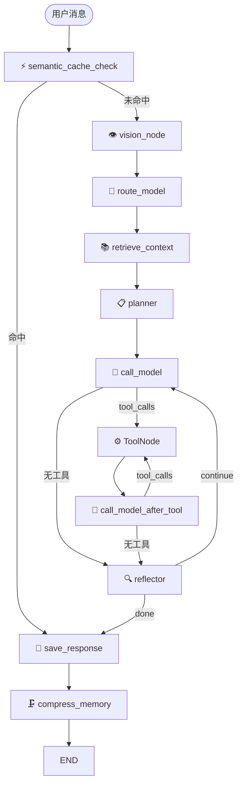

# ChatFlow 后端

> FastAPI + LangGraph Agent 图架构 + DB-first 状态机

完整架构文档、流程图、配置说明请查看：**[主页 README](../../README.md)**

---

## 本地开发快速启动

```bash
cd llm-chat/backend
python -m venv venv && source venv/bin/activate   # Windows: venv\Scripts\activate
pip install -r requirements.txt
python main.py
```

API 文档：**http://localhost:8000/docs**

---

## 技术栈

| 类别 | 技术 |
|------|------|
| 框架 | Python 3.12 · FastAPI · asyncio |
| AI 编排 | LangChain · LangGraph |
| 状态机 | python-statemachine（对话/工具/SSE 事件） |
| 关系数据库 | PostgreSQL 16（含 JSONB 原子更新） |
| 向量数据库 | Qdrant |
| 缓存/共享状态 | Redis Stack（语义缓存 KNN + 跨 worker 状态同步） |

---

## 项目结构

```
backend/
├── main.py              # FastAPI 入口 + API 路由
├── config.py            # 统一配置（pydantic-settings）
├── models.py            # Pydantic 请求/响应模型
├── graph/               # LangGraph 图定义
│   ├── agent.py         # 图构建与编译
│   ├── state.py         # GraphState（含 step_results 字段）
│   ├── edges.py         # 条件路由逻辑
│   ├── nodes/           # 图节点实现
│   │   ├── base.py      # BaseNode（_stream_tokens 等共享工具）
│   │   ├── vision_node.py   # 多模态图片理解（流式）
│   │   ├── route_node.py    # 意图路由（空 choices 防御）
│   │   ├── planner_node.py  # 认知规划
│   │   ├── retrieve_context_node.py # RAG + 历史组装
│   │   ├── call_model_node.py    # 主推理（步骤隔离上下文）
│   │   ├── call_model_after_tool_node.py # 工具后综合
│   │   ├── reflector_node.py     # 步骤评估（5条快速路径）
│   │   ├── save_response_node.py # 持久化
│   │   └── cache_node.py     # 语义缓存节点
│   └── runner/          # SSE 流驱动
│       ├── stream.py    # SSE 主驱动（队列+心跳+断点续传）
│       ├── context.py   # StreamContext
│       └── dispatcher.py # 事件分发（职责链）
├── memory/              # 记忆系统
│   ├── store.py         # 短期记忆 CRUD
│   ├── context_builder.py # 消息组装（8层优先级）
│   ├── compressor.py    # 语义压缩
│   └── schema.py        # 数据模型
├── rag/                 # 长期记忆（Qdrant）
│   ├── retriever.py     # 向量检索
│   └ ingestor.py        # 写入 Qdrant
├── cache/               # 语义缓存（Redis KNN）
├── fsm/                 # 状态机
│   ├── conversation.py  # 对话生命周期
│   ├── tool_execution.py # 工具执行状态
│   ├── plan_step.py     # 计划步骤状态
│   └ sse_events.py      # SSE 事件类型注册表
├── db/                  # 数据库层
│   ├── models.py        # SQLAlchemy ORM
│   ├── database.py      # 异步会话
│   ├── redis_state.py   # Redis 跨 worker 共享状态
│   ├── migrate.py       # 幂等迁移
│   └ plan_store.py      # 执行计划 CRUD
├── llm/                 # LLM 工厂（模型无关适配层）
│   ├── client.py        # OpenAI 兼容客户端
│   └ embeddings.py      # Embedding 工厂
├── tools/               # 工具系统
│   ├── skill.py         # Skill 框架（自动发现注册）
│   ├── builtin/         # 内置工具
│   └── mcp_loader.py    # MCP 协议扩展
├── sandbox/             # 代码沙箱
├── routers/             # API 路由模块
├── services/            # 服务层
├── prompts/             # 系统提示词目录
│   ├── system.md        # 全局系统提示
│   └ nodes/             # 节点专用提示词
└── tests/               # 测试代码
```

---

## 核心架构

### LangGraph 图节点



### 8 层上下文优先级

```
Layer 1: 平台身份 + 全局规则（DEFAULT_SYSTEM_PROMPT + 当前日期）
Layer 2: 项目规则（core_memory.project_rules，硬约束）
Layer 3: 用户画像（core_memory.user_profile）
Layer 4: 已确认偏好（core_memory.learned_preferences）
Layer 5: 当前任务（core_memory.current_task）
Layer 6: 对话背景摘要（mid_term_summary）
Layer 7: 长期记忆（RAG 检索）
Layer 8: 可用工具指南（底层，避免争抢注意力）
```

### 三级记忆体系

| 层级 | 机制 | 特性 |
|------|------|------|
| **短期** | 滑动窗口（最近 N 轮） | 长 AI 历史回复自动截断至 800 字 |
| **中期** | 达到阈值自动语义压缩 | 保留滑动窗口完整性 |
| **长期** | 压缩时写入 Qdrant | Top-K 检索 + 去重过滤 |

### 状态机

| 状态机 | 状态流转 |
|--------|---------|
| 对话 | `ACTIVE → STREAMING → COMPLETED/ERROR` |
| 工具执行 | `RUNNING → DONE/ERROR/TIMEOUT` |
| 计划步骤 | `PENDING → RUNNING → DONE/FAILED` |

---

## API 接口

| 方法 | 路径 | 说明 |
|------|------|------|
| `POST` | `/api/chat` | 流式对话（SSE） |
| `POST` | `/api/chat/{id}/stop` | 停止对话 |
| `GET` | `/api/conversations` | 对话列表 |
| `POST` | `/api/conversations` | 创建对话 |
| `GET` | `/api/conversations/{id}/full-state` | 完整状态恢复 |
| `GET` | `/api/conversations/{id}/resume` | SSE 断线重连 |
| `GET` | `/api/artifacts/{id}` | 产物内容 |
| `GET` | `/api/tools` | 可用工具列表 |

---

## 关键文件详解

### graph/nodes/

| 文件 | 职责 | 行数 |
|------|------|------|
| `base.py` | BaseNode（共享 `_stream_tokens` / `_is_audit_error`） | ~100 |
| `route_node.py` | 意图路由（空 choices 防御降级） | ~150 |
| `planner_node.py` | 认知规划（code 复杂任务也触发） | ~520 |
| `call_model_node.py` | 步骤隔离上下文（步骤0 vs 步骤1+） | ~480 |
| `reflector_node.py` | 步骤评估（5 条快速路径） | ~420 |
| `save_response_node.py` | 持久化消息 + step_results | ~420 |

### graph/runner/

| 文件 | 职责 |
|------|------|
| `stream.py` | SSE 驱动（断点续传 + 心跳 + 停止握手） |
| `dispatcher.py` | 事件分发职责链 |

### memory/

| 文件 | 职责 |
|------|------|
| `context_builder.py` | 长期记忆去重 + 渐进遗忘 + 历史截断 + 8层组装 |
| `compressor.py` | 语义压缩（触发阈值时执行） |

---

## 配置说明

关键配置项（`.env`）：

```bash
# LLM 接口
LLM_BASE_URL=https://api.openai.com/v1
CHAT_MODEL=gpt-4o
SUMMARY_MODEL=gpt-4o-mini

# 记忆参数
SHORT_TERM_MAX_TURNS=10
COMPRESS_TRIGGER=8
LONGTERM_MEMORY_ENABLED=true
QDRANT_URL=http://qdrant:6333

# 语义缓存
SEMANTIC_CACHE_ENABLED=true
REDIS_URL=redis://redis:6379
SEMANTIC_CACHE_THRESHOLD=0.88
```

---

## 测试规范

- 测试用例文档：`backend/test_case.md`
- 测试代码：`backend/tests/`
- 标记：`@pytest.mark.unit` / `@pytest.mark.integration` / `@pytest.mark.smoke`

---

## 开发铁律

详见 **[spec.md](../../spec.md)**，核心原则：

1. 不从模型输出文本推断状态 — 用 DB 字段
2. 不在 `content` 中嵌入结构化数据 — 用独立字段
3. 所有 LLM 调用必须流式 — 禁用 `ainvoke`
4. 状态变更必须走状态机 — 先转换再持久化